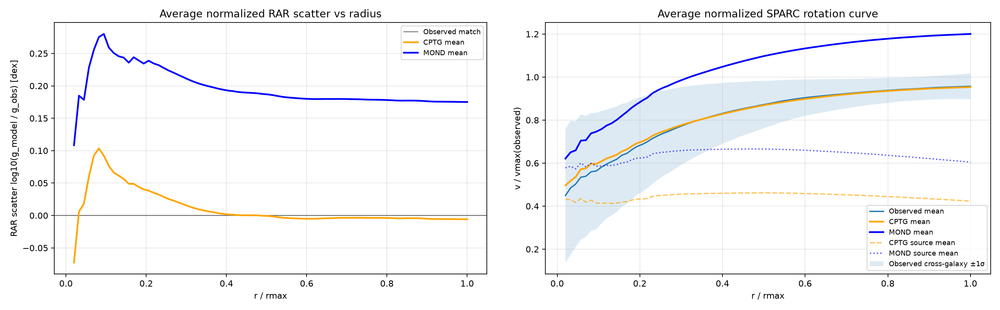
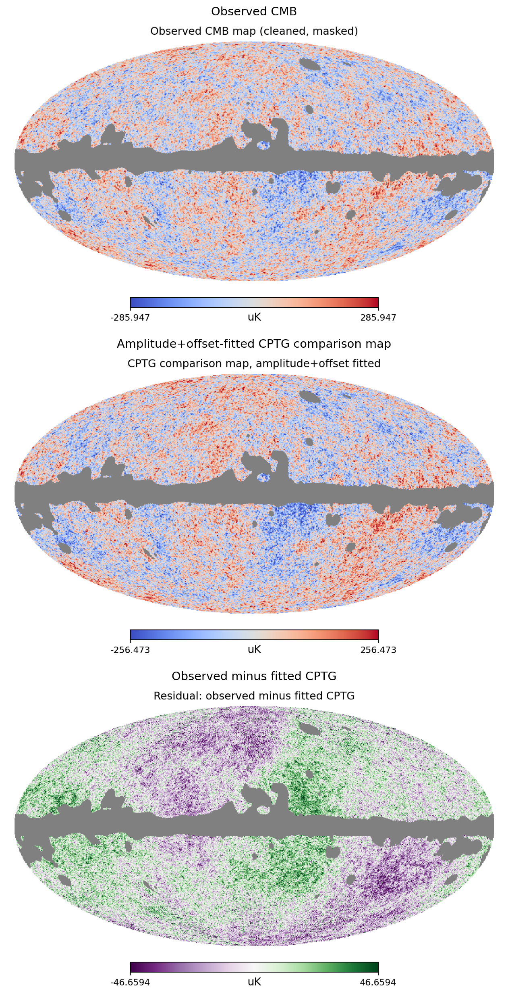

# CPTG
## Curvature Polarization Transport Gravity

## Contents

- [Core CPTG Papers](#start-here-core-cptg-papers)
- [Available Tools](#available-tools)
- [Overview](#overview)
- [Current Research Status](#current-research-status)
- [Repository Contents](#what-this-repository-contains)
- [Reproducing the Public Benchmarks](#reproducing-the-public-benchmarks)
- [CPTG SPARC Browser Workbench](#galaxy-scale-test-cptg-sparc-browser-workbench)
- [Curvature-Weighted Structural Mode Index](#curvature-weighted-structural-mode-index)
- [Outer-Slope Convergence Test](#outer-slope-convergence-test)
- [Bullet Cluster Benchmark](#cluster-merger-test-bullet-cluster-benchmark)
- [Cluster Active-Gate Test](#cluster-scale-active-gate-test-accept-and-x-cop)
- [Nuclear-Scale Reaction Program](#nuclear-scale-reaction-program-deuterium-proton-radiative-capture)
- [Cosmology and Comparison-Layer Tests](#cosmology-and-comparison-layer-tests)
- [What CPTG Is Not](#what-cptg-is-not)
- [Citation](#citation)

## Start Here: Core CPTG Papers

- **[Curvature Polarization Transport Gravity: A Unified Geometric Framework for Cosmic Structure and Expansion](https://raw.githubusercontent.com/CLG2025/CPTG/main/research/CPTG_Unified_Geometric_Framework_Cosmic_Structure_Expansion.pdf)**  
  Primary CPTG theory paper. This manuscript lays out the unified geometric framework: baryon-sourced curvature polarization, curvature transport, the cosmic/structure expansion connection, galaxy and cluster limits, and the broader comparison-layer program.

- **[CPTG Geometric Pi Branch Comparison Coordinates](https://raw.githubusercontent.com/CLG2025/CPTG/main/research/CPTG_Geometric_Pi_Branch_Comparison_Coordinates.pdf)**  
  Comparison-coordinate guide for the locked geometric pi branch. This paper explains how CPTG-native quantities are mapped into observational coordinates for CMB, BAO, BBN, supernova, growth, and DESI-style comparison layers without treating those observational coordinates as the theory itself.

- **[The Science Behind CPTG: A Geometric Alternative to Dark Matter, Dark Energy, and MOND](https://raw.githubusercontent.com/CLG2025/CPTG/main/research/The_Science_Behind_CPTG.pdf)**  
  A public-facing introduction to Curvature Polarization Transport Gravity. This paper explains what makes CPTG different from dark matter, dark energy, and MOND-style approaches: baryon-sourced curvature polarization, curvature transport, structural modes, active gates, and scalable comparison coordinates derived from one geometric framework rather than sector-by-sector tuning.
  
---

## Available Tools

The repository provides two complementary public access paths:

- **CPTG academic package** — the compact reproducibility archive for the core SPARC galaxy and Bullet Cluster reduced-limit benchmarks.
- **CPTG SPARC Browser Workbench v1.11.9** — a larger standalone application for users focused on interactive SPARC rotation-curve analysis.

### CPTG SPARC Browser Workbench

The **CPTG SPARC Browser Workbench v1.11.9** is a local browser application available as a Windows release package and as a Python application for supported Windows and Linux environments.

It analyzes the included SPARC galaxy rotation-curve files with CPTG and MOND and supports single-galaxy and batch analysis, SPARC metadata filtering, plots, tables, summaries, and downloadable result bundles.

[View the interface](images/CPTG_SPARC_Browser_Workbench.png) · [Download v1.11.9](https://github.com/CLG2025/CPTG/releases/tag/v1.11.9)

### CPTG Pi-Bridge

CPTG Pi-Bridge is a local [research workbench](images/CPTG-Pi-Bridge-Local-Workbench.png) currently in beta development. It is designed to load public astronomy and cosmology datasets, select a CPTG comparison branch, run the audit engine, review results, and export reproducible validation packages.

Its translation layer uses the geometric-π comparison-coordinate method defined in the CPTG π-branch paper. CPTG-native quantities remain in their native geometric branch before being projected into conventional CMB, BAO, BBN, supernova, growth, and DESI-style comparison coordinates.

---

## Overview

*Curvature Polarization Transport Gravity* (CPTG) is an active geometric-gravity framework exploring whether effects commonly attributed to dark matter can arise from the response of spacetime curvature to ordinary baryonic matter.

CPTG is built around two linked mechanisms:

* **Curvature polarization**, which modifies the effective gravitational response according to the strength and structure of the field.
* **Curvature transport**, which allows organized curvature to be redistributed directionally in dynamic systems.

The framework is tested across galaxy rotation curves, cluster-merger lensing, relaxed galaxy clusters, cosmology-facing comparison layers, and a nuclear-scale radiative-capture commissioning program. The repository provides the current theory papers, CPTG SPARC Browser Workbench, included data, public figures, and reproducible validation materials for inspection, testing, and criticism.

## Current Research Status

CPTG is being developed as a geometric framework with reduced-limit tests and comparison-layer audits. The public status is best read by separating reproducible benchmarks, coordinate-layer validations, diagnostic passes, and active theory-development work.

| Area | Current CPTG status | Claim level |
|---|---|---|
| SPARC galaxy rotation curves | Public reduced-limit SPARC test available through the compact academic package and the interactive browser workbench | Reproducible galaxy-scale benchmark |
| Bullet Cluster merger plane | Public reduced merger-plane curvature-transport/lensing reconstruction | Reproducible cluster-merger benchmark |
| Cluster active-gate apertures | Same-aperture cluster-response tests using baryonic loading, support temperature, redshift, and aperture radius | Diagnostic cluster-scale active-gate and X-COP consistency [pass](#Cluster-Scale-Active-Gate-Test-ACCEPT-and-X-COP) |
| Nuclear-scale deuterium-proton radiative capture | Native CPTG geometry-to-reaction-rate commissioning for `D(p,γ)³He` and the reverse photodisintegration channel. The retained reproducibility frontier now verifies the official TNFME/3NF backend, the 104-matrix pp/np/nn ledger, native A=3 bound-state objects, A=3 normalization and energy conventions, source-literal TNFME 24→64 Cubherm radial action, and the closed channel/support embeddings needed for the common-Hamiltonian audit. | Active reaction-specific [source-contract closure and reproducibility program](#nuclear-scale-reaction-program-deuterium-proton-radiative-capture); final residual, S-factor, and rate prediction remain pending source-literal NN radial-action and A=3 kinetic-action contracts |
| Pantheon+ supernova distances | Full-covariance relative distance-shape comparison with marginalized intercept | Distance-shape [pass](#Pantheon-Supernova-Distance-Shape-Test), not an H0 calibration claim |
| BBN abundance and lithium tests | Transported BBN coordinate and locked lithium source-network gate checked in independent BBN workflows | Coordinate-layer and source-network [validation](#BBN-Abundance-and-Lithium-Source-Network-Tests) under stated controls |
| Weak-lensing S8 | Compressed comparison against representative weak-lensing and CMB S8 anchors | Diagnostic [pass](#Weak-Lensing-S8-Comparison), not a full shear likelihood |
| CMB comparison-map closure | Locked geometric-pi CMB branch tested against real Planck/WMAP temperature-map products and null controls | Real-map [comparison-map closure](#CMB-Comparison-Map-Closure) pass |
| CMB Route B Option 1 bridge | Fixed amplitude-level curvature-transport bridge tested through CMB spectrum and Planck likelihood-coordinate plumbing | Geometry-first comparison-coordinate bridge [validation](#CMB-Route-B-Option-1-Curvature-Transport-Bridge) |
| DESI compressed ShapeFit and BAO | Compressed-coordinate and ruler-wrapper diagnostics | Coordinate-level [support](#DESI-DR1-Compressed-ShapeFit-and-BAO-Quarter-Ruler), not full raw DESI validation |
| Horizon and Hubble-tension mechanisms | Structural articles mapping CPTG-native branches into observational comparison layers | Theory [mechanism](#Hubble-Tension-Bridge) and derivation-stage interpretation |

Claim levels are used consistently throughout this README:

- **Benchmark** — a reproducible reduced-limit calculation compared with data.
- **Diagnostic pass** — a result compatible with the stated controls.
- **Coordinate-layer validation** — a tested observational mapping or likelihood interface.
- **Closure pass** — agreement within a declared fixed-branch closure protocol.
- **Theory mechanism** — a derived interpretation that is not yet a complete observational likelihood test.

## What This Repository Contains

This repository contains the public academic package for CPTG, including:

- current CPTG theory manuscripts and research notes,
- reduced benchmark scripts for galaxy and cluster tests,
- supporting public data packages and metadata when included,
- comparison-layer scripts and audit outputs when publicly included,
- nuclear reaction-rate source packages, authority records, and replay audits when publicly included,
- CMB source/data availability notes and strict rerun file lists,
- figures, summaries, and reproducibility material.

The recommended compact reproducibility download is **`CPTG_academic_package.zip`**, located in the **`/archive/`** folder. It preserves the public core benchmark environment for the SPARC galaxy and Bullet Cluster reduced-limit tests.

The larger **CPTG SPARC Browser Workbench v1.11.9** is distributed separately for interactive rotation-curve analysis. Additional Python files in the repository should be treated as version upgrades, development variants, or replacement implementations unless a specific package README states otherwise.

## Reproducing the Public Benchmarks

The public benchmarks are intended to be inspectable and reproducible.

1. Download or clone the repository.
2. Open the **`/archive/`** folder.
3. Use **`CPTG_academic_package.zip`** for the public benchmark package.
4. Extract the archive into a working folder.
5. Run the benchmark scripts with Python 3.
6. Compare generated outputs against the included figures and summary files.

The package root directory may be renamed freely. Reproducibility depends on preserving the internal relative layout, or on passing explicit input/output paths when running scripts. Planck and WMAP FITS products are not bundled with CMB map-closure packages; they must be placed in the documented data location or supplied by command-line path.

The main public benchmark scripts are:

| Package or tool | Purpose |
|---|---|
| `SPARC_CPTG_MOND_Benchmark.py` | Original galaxy rotation-curve benchmark against SPARC data. |
| `CPTG_Bullet_Cluster_Merger.py` | Reduced merger-plane curvature-transport/lensing benchmark. |
| `CPTG_ClusterActiveGate_IntegratedTool_v0_5.py` | Single-aperture and aperture-ladder cluster-response calculations from baryonic loading, support temperature, redshift, and aperture. Requires the [public X-COP cluster archive](https://drive.switch.ch/index.php/s/j3WUOYXWgv9Jbnz/download). |
| `CPTG_MOND_Upsilon_SPARC_Benchmark.py` | MOND/CPTG comparison with stellar mass-to-light freedom. |
| `CPTG-CMB.zip` | CMB comparison-map closure scripts for Planck/WMAP component maps, split maps, smoothing/mask controls, visual comparisons, summary reports, and null-envelope controls. |

---

## Galaxy-Scale Test: CPTG SPARC Browser Workbench

The **CPTG SPARC Browser Workbench v1.11.9** provides a local browser interface for testing CPTG and MOND against SPARC galaxy rotation-curve data.

The standalone workbench [package](https://github.com/CLG2025/CPTG/releases/tag/v1.11.9) includes the SPARC galaxy data needed to begin running analyses immediately. It supports:

- single-galaxy analysis,
- multi-galaxy analysis,
- full SPARC directory scans,
- SPARC metadata files,
- primary-sample filtering,
- CPTG and MOND fit comparisons,
- averaged normalized rotation curves,
- averaged RAR scatter vs radius,
- galaxy-level fit and structural-mode summaries.

All calculations are performed locally. Each galaxy is solved independently before aggregate results and plots are generated.

For aggregate plots, each galaxy is normalized independently and interpolated onto a shared normalized radial grid. Each galaxy receives equal weight at each grid location, and the outer endpoint at `r / r_max = 1` is retained.

SPARC data source: Lelli, McGaugh, and Schombert, *The Astronomical Journal* 152, 157 (2016), “SPARC: Mass Models for 175 Disk Galaxies with Spitzer Photometry and Accurate Rotation Curves.”

The figure below summarizes the averaged SPARC results produced by the workbench.



<sup>Figure: CPTG SPARC Browser Workbench averaged results for the full 175-galaxy SPARC run. Primary-sample metadata filtering was not applied to this figure.</sup>

---

## Curvature-Weighted Structural Mode Index

The Curvature-Weighted Structural Mode Index, **N**, is a CPTG diagnostic derived from the solved acceleration field.

It measures how curvature support is organized inside a galaxy:

**N = R / λ**

where:

* **R** is the outer solved radius.
* **λ** is the curvature-weighted structural scale.

The workbench translates the continuous mode value into a named **CSMI Type**:

| Structural Mode N | CSMI Type             |
| ----------------: | --------------------- |
|          N ≤ 1.45 | Dwarf Irregular       |
|   1.45 < N ≤ 1.75 | Magellanic Irregular  |
|   1.75 < N ≤ 1.95 | LSB Dwarf Disk        |
|   1.95 < N ≤ 2.15 | Transition Dwarf      |
|   2.15 < N ≤ 2.35 | LSB Spiral            |
|   2.35 < N ≤ 2.55 | Very Late Spiral      |
|   2.55 < N ≤ 2.80 | Late Spiral           |
|   2.80 < N ≤ 3.05 | Intermediate Spiral   |
|   3.05 < N ≤ 3.30 | Early Spiral          |
|   3.30 < N ≤ 3.55 | Bulged Spiral         |
|   3.55 < N ≤ 3.72 | Lenticular/Early Disk |
|          N > 3.72 | High-Mode Outlier     |

The CSMI Type is assigned only from the solved mode value. It is not taken from galaxy names, SPARC metadata, catalog morphology, or visual classification. As larger and more diverse galaxy samples are analyzed, future CSMI catalogs will likely expand, subdivide, or refine the named structural types to represent newly resolved mode populations. Any additional categories would remain derived from the solved CPTG mode distribution rather than being imposed from conventional morphological classifications.

Mode-filtered runs allow galaxies with similar CPTG structural organization to be evaluated as subsets of the full database.

In public-facing terms, **N** asks:

> How is the solved curvature structure organized inside this galaxy?

This makes the mode and its CSMI Type theory-derived structural diagnostics rather than conventional galaxy classifications.

---

## Outer-Slope Convergence Test

The CPTG outer-slope convergence test evaluates a theory-defined prediction of the reduced galaxy equation: once the solved field is extended beyond the outermost measured SPARC radius, the rotation-curve response should approach a stable CPTG outer-regime trend rather than drift arbitrarily.

This is an important strength of CPTG because the far-outer behavior follows from the solved curvature-polarization and transport structure. It is not independently fitted to artificial outer data points.

The purpose of the test is not to claim that current observations already measure the entire extended regime. It checks whether the reduced CPTG galaxy equation develops the stable long-range behavior predicted by the theory when continued beyond the observed rotation-curve domain.

In CPTG, weak-field galaxy outskirts should gradually approach a consistent curvature-polarization pattern. The convergence plot visualizes that prediction across the SPARC galaxy sample.

The second benchmark figure shows the stacked CPTG outer-slope convergence trend for the SPARC galaxy sample.


<sup>Figure: CPTG outer-slope convergence in the extended galaxy-outskirts regime.</sup>

---

## Cluster-Merger Test: Bullet Cluster Benchmark

The **`CPTG_Bullet_Cluster_Merger.py`** script tests the cluster-merger limit of the theory through a reduced Bullet Cluster merger-plane implementation.

It constructs baryonic gas and galaxy components, builds curvature-polarization background fields, evolves a transported-curvature mode, and produces a normalized convergence/kappa reconstruction.

The model is scored against observed Bullet Cluster gas, galaxy, and lensing separations, including:

- Bullet-side mass-galaxy offset,
- Bullet-side mass-ICM offset,
- main-cluster north mass-ICM offset,
- main-cluster south mass-ICM offset,
- main-subclump separation,
- cluster-scale lensing separation.

The public significance of this test is that CPTG attempts to address not only galaxy rotation curves, but also dissociative cluster mergers, which are often considered strong evidence for collisionless dark matter.

---

The third benchmark figure shows how CPTG reconstructs displaced lensing structure in the Bullet Cluster merger plane.

![Normalized CPTG kappa reconstruction of the Bullet Cluster merger plane. The map shows two main convergence structures: a compact Bullet-side lensing feature on the left, displaced from the Bullet gas peak, and a larger main-cluster lensing structure on the right with north and south substructure. White contours trace the strongest reconstructed convergence regions. Markers identify Bullet and main gas peaks, galaxy peaks, lensing peaks, and main-cluster north/south lens peaks. A scale bar marks 100 kpc.](images/CPTG-Curvature-Transport-Model.png)

<sup>Figure: CPTG Bullet Cluster kappa reconstruction showing gas-lensing separation.</sup>

---

## Cluster-Scale Active-Gate Test: ACCEPT and X-COP

The [cluster-scale active-gate](https://raw.githubusercontent.com/CLG2025/CPTG/main/research/CPTG_Cluster-Scale_Active-Gate_Extension.pdf) work extends CPTG beyond galaxy rotation curves and reduced merger-plane reconstruction into relaxed or approximately coherent galaxy-cluster apertures. The calculation asks whether a cluster aperture can be described by baryonic loading, support temperature, redshift, and aperture radius through one active curvature-response state.

For a selected aperture `R_delta`, the calculation uses gas mass, stellar/intracluster-light support where available, temperature, redshift, and aperture radius to compute the active-gate response and the predicted CPTG mass for the same aperture.

This work provides a same-aperture test of both the accuracy and structural response of the CPTG cluster active-gate law. Across the tested 12-cluster X-COP R₅₀₀ sample, the predicted CPTG masses achieved a median CPTG-to-hydrostatic mass ratio of 0.9892, corresponding to a median absolute fractional difference of approximately 1.08%. The mean absolute difference was approximately 1.19%, and the largest individual difference was approximately 2.68%. The X-COP aperture ladder further reproduced the predicted transition from closure-stable inner apertures to greater active-gate sensitivity at R₅₀₀. Independently, the ACCEPT analysis ordered 379 clean profile rows across 45 clusters into the expected closure-stable, watch, suppressed, and strongly suppressed response states. Together, these results show that the same fixed CPTG law produces percent-level same-aperture mass agreement while also recovering the theory-defined structural ordering of cluster apertures.

This result should be read as a diagnostic cluster-scale active-gate pass and an X-COP same-aperture consistency pass. It is not a claim that one single-aperture formula describes strong cluster mergers without decomposition. Strong mergers are best treated separately unless gas, stellar, temperature, and mass components can be assigned consistently to the same dynamical aperture.

## Nuclear-Scale Reaction Program: Deuterium-Proton Radiative Capture

The CPTG nuclear program is commissioning a native geometry-to-reaction-rate calculation for deuterium-proton radiative capture,

```text
²H + p → ³He + γ
```

together with the reverse photodisintegration channel,

```text
³He + γ → p + ²H
```

The mission is to carry CPTG structural geometry through a reaction-specific bound-to-continuum transition calculation and into an auditable rate prediction that can be compared directly with measured nuclear observables and their uncertainties.

This program is deliberately audit-first. The present public status is not a final `S(E)`, cross-section, thermonuclear-rate, or reverse-rate claim. It is a source-contract closure program for the interaction-consistent nuclear baseline that must exist before a CPTG geometry-to-rate correction can be responsibly populated.

### Current Public Status

The retained frontier is the `v10.502` source-contract review state. The common-Hamiltonian action audit has closed seven of ten required C2.4 action elements and has reduced the remaining work to two source-literal implementation contracts plus the residual definition that depends on them.

Closed C2.4 action elements include:

- official TNFME/3NF backend identity and exact LMAX13 factorized recoupling support;
- native A=3 bound-state object binding and mirror-registry handling;
- TNFME `24 → 64` Cubherm radial action, replayed through the published Appendix-B cubic-Hermite rule;
- A=3 normalization convention;
- A=3 component-axis contraction rule;
- expected A=3 energy formula;
- TNFME `42 → 76` and LMAX13 `104 → 76` active-channel embeddings;
- NN `104`-ledger to native A=3 NN-support projection, with source-extra unsupported rows explicitly accounted.

The remaining C2.4 blockers are:

```text
NN_81_TO_A3_64_ACTION
A3_KINETIC_ACTION
COMMON_H_RESIDUAL_AND_TOLERANCE
```

The last item is dependent: the common-Hamiltonian residual is not executed until the NN radial-action and A=3 kinetic-action contracts are source-literally promoted.

### Verified Computational Architecture

The accepted calculation chain now includes:

- native bound-state and continuum-state handling for the locked `D_P_GAMMA_HE3` reaction;
- the accepted `96 x 96` auxiliary/common-support grid and its interpolation stencils;
- a `99`-anchor radial six-map expansion;
- sparse six-map pullback and adjoint transport;
- a global affine support registry of `272` nodes;
- an active operator-support union of `199` nodes, with exact identity preserved across the retained contraction lineage;
- exact production pp `¹S₀` matrices at `1`, `5`, `10`, and `25 MeV`;
- a verified `104`-matrix pp/np/nn production-grid ledger;
- official TNFME/3NF source identity and executable backend evidence;
- exact LMAX13 recoupling and factorized 3NF backend replay;
- two native A=3 bound-state objects with `3namp`, native grids, weights, and channel registries;
- five independently retained electromagnetic-current directions:
  `C15'`, `C16'`, `d8'`, `d9'`, and `d21'`;
- reproducible source manifests, SHA-256 ledgers, ZIP-integrity checks, and exact-input replay at each accepted stage.

### Current Verified Milestones

The accepted support architecture contains a `272`-node global affine registry and a distinct `199`-node active operator-support union. The accepted six-map transport, `99`-anchor operator expansion, exchange reconstruction, pullback/adjoint structure, and five-current basis are preserved without reduction.

The exact production pp `¹S₀` interaction has been captured and preserved as four hash-locked `81 x 81` matrices at laboratory energies of `1`, `5`, and `10`, and `25 MeV`. The corresponding production phases and solver outputs were replayed and independently verified.

The verified production-grid charge-sector ledger contains:

```text
np: 48 matrices
pp: 28 matrices
nn: 28 matrices
total: 104 matrices
```

The accepted matrix set contains both single-channel and coupled-channel objects:

```text
single-channel matrices: 72 at 81 x 81
coupled-channel matrices: 32 at 162 x 162
```

The native A=3 object binding has also been verified. The accepted objects contain `/3NBOUNDFAD` and `/3NBOUNDWAVE` groups with native `3namp` arrays, `p12p`, `p12w`, `p3p`, `p3w`, `qnalpha3N`, and `qnalphaNN`. The two accepted A=3 objects are treated as a mirror/sign-conjugate pair: their NN channel registries agree, while the three-body registry differs by the expected `2mT` sign relation.

The C2.4 source-contract audit has closed several important Hamiltonian-action ingredients:

```text
TNFME 24→A3 64 Cubherm action: closed
A3 normalization convention: closed
A3 component contraction rule: closed
Expected A3 energy formula: closed
TNFME42→A3 76 embedding: closed
LMAX13 104→A3 76 active embedding: closed
NN104 native A3 support projection: closed
```

The exact A=3 normalization/source contraction currently retained is:

```python
norm = 3.0*np.einsum("ijkl,ijkl,k,k,j,j->", fad, wave, p12**2, w12, p3**2, w3)
```

The accepted A=3 expected-energy relation is:

```python
binding_energy_mev = BENER*hbarc
```

The NN source-ledger support projection is also closed. Of the `104` source-ledger rows, `96` project to native A=3 NN support. The eight accounted source-extra rows are:

```text
np 1P1 at 1, 5, 10, 25 MeV
np 1F3 at 1, 5, 10, 25 MeV
```

These rows are not treated as missing matrices; they are source-extra scattering rows outside the retained native A=3 bound-state NN-support registry.

### Current Research Objective

The target is to promote or reject, source-literally, the two unresolved action contracts:

```text
NN_81_TO_A3_64_ACTION
A3_KINETIC_ACTION
```

Only after those contracts are closed can the common-Hamiltonian residual and tolerance be defined and executed. Until then, the nuclear program remains an active reaction-specific derivation and reproducibility program rather than a final astrophysical-rate result.

## Cosmology and Comparison-Layer Tests

CPTG cosmology-facing work is organized around the distinction between CPTG-native geometric quantities and conventional observational summaries. The goal is not to force CPTG into standard parameter language, but to make controlled comparisons with quantities commonly reported from supernova, CMB, abundance, growth, and large-scale-structure analyses.

### Current Locked Geometric Pi Branch

The current locked CPTG comparison branch uses:

```text
p_C = pi
p_ac = 3 - pi/100 = 2.968584073464
G_T = p_ac / p_C = 0.944929658551
sqrt(G_T) = 0.972074924351
H0^(pi) = 69.4162507897 km s^-1 Mpc^-1
H0_CMB^CPTG = 67.4777967351 km s^-1 Mpc^-1
A_lens = 1
```

The locked CMB comparison-map row used in the current Planck/WMAP map-space closure paper is:

```text
H0 = 67.4777967351 km s^-1 Mpc^-1
omega_b h^2 = 0.022527857494
omega_c h^2 = 0.117685841620526
n_s = 0.968584073464
N_eff = 2.968584073464
A_s = 2.136283004441e-9
tau = 0.058930875934
A_lens = 1
```

These values define the fixed geometric-pi CMB branch used in the current comparison-map closure audits. The branch is locked before the map tests and is not refit to the individual CMB maps.

### CMB Comparison-Map Closure

CPTG CMB map work is organized as a [real-map comparison test](https://raw.githubusercontent.com/CLG2025/CPTG/main/research/CPTG_CMB_Comparison_Map_Closure.pdf) between the locked geometric-pi CMB branch and public CMB map products. The current paper uses real Planck component maps, Planck split maps, and WMAP low-ell support products.



<sup>Figure: SMICA visual comparison from the CMB comparison-map closure paper. Top: observed Planck SMICA temperature map. Center: fitted CPTG comparison map. Bottom: observed-minus-fitted-CPTG residual.</sup>

The map-space procedure uses the same comparison coordinate for CPTG, the Planck envelope, and controls. It reads the temperature field from the public CMB map product, applies the documented mask, converts to microkelvin, downgrades to `Nside = 256`, removes the monopole and dipole on the valid sky, and evaluates fitted residuals under the same amplitude-plus-offset rule:

```text
T_fit(nhat) = A T_template(nhat) + B
```

The central public result is that the locked CPTG geometric-pi branch reaches near-degenerate CMB comparison-map closure with the Planck comparison envelope across the tested real-map products and controls, while generic null envelopes fail much more strongly under the same map-space procedure. The detailed RMS tables, control ladders, and null-envelope audits are contained in the dedicated CMB comparison-map closure material.

#### Original Planck and WMAP FITS Inputs

The original Planck and WMAP survey FITS maps are **not bundled** because they are large public data products. For the strict CMB comparison-map closure rerun, use only the tested FITS inputs below. Do not add optional masks, alternate survey products, or substitute component maps to the control environment.

| Test layer | Required local filename | Public source |
|---|---|---|
| Planck SMICA full map | [`COM_CMB_IQU-smica_2048_R3.00_full.fits`](https://irsa.ipac.caltech.edu/data/Planck/release_3/all-sky-maps/maps/component-maps/cmb/COM_CMB_IQU-smica_2048_R3.00_full.fits) | Planck R3 / IRSA |
| Planck SMICA-noSZ full map | [`COM_CMB_IQU-smica-nosz_2048_R3.00_full.fits`](https://irsa.ipac.caltech.edu/data/Planck/release_3/all-sky-maps/maps/component-maps/cmb/COM_CMB_IQU-smica-nosz_2048_R3.00_full.fits) | Planck R3 / IRSA |
| Planck NILC full map | [`COM_CMB_IQU-nilc_2048_R3.00_full.fits`](https://irsa.ipac.caltech.edu/data/Planck/release_3/all-sky-maps/maps/component-maps/cmb/COM_CMB_IQU-nilc_2048_R3.00_full.fits) | Planck R3 / IRSA |
| Planck SEVEM full map | [`COM_CMB_IQU-sevem_2048_R3.00_full.fits`](https://irsa.ipac.caltech.edu/data/Planck/release_3/all-sky-maps/maps/component-maps/cmb/COM_CMB_IQU-sevem_2048_R3.00_full.fits) | Planck R3 / IRSA |
| Planck Commander full map | [`COM_CMB_IQU-commander_2048_R3.00_full.fits`](https://irsa.ipac.caltech.edu/data/Planck/release_3/all-sky-maps/maps/component-maps/cmb/COM_CMB_IQU-commander_2048_R3.00_full.fits) | Planck R3 / IRSA |
| Planck SMICA half-mission 1 | [`COM_CMB_IQU-smica_2048_R3.00_hm1.fits`](https://irsa.ipac.caltech.edu/data/Planck/release_3/all-sky-maps/maps/component-maps/cmb/COM_CMB_IQU-smica_2048_R3.00_hm1.fits) | Planck R3 / IRSA |
| Planck SMICA half-mission 2 | [`COM_CMB_IQU-smica_2048_R3.00_hm2.fits`](https://irsa.ipac.caltech.edu/data/Planck/release_3/all-sky-maps/maps/component-maps/cmb/COM_CMB_IQU-smica_2048_R3.00_hm2.fits) | Planck R3 / IRSA |
| Planck SMICA odd-ring split | [`COM_CMB_IQU-smica_2048_R3.00_oe1.fits`](https://irsa.ipac.caltech.edu/data/Planck/release_3/all-sky-maps/maps/component-maps/cmb/COM_CMB_IQU-smica_2048_R3.00_oe1.fits) | Planck R3 / IRSA |
| Planck SMICA even-ring split | [`COM_CMB_IQU-smica_2048_R3.00_oe2.fits`](https://irsa.ipac.caltech.edu/data/Planck/release_3/all-sky-maps/maps/component-maps/cmb/COM_CMB_IQU-smica_2048_R3.00_oe2.fits) | Planck R3 / IRSA |
| WMAP 9-year ILC map | [`wmap_ilc_9yr_v5.fits`](https://lambda.gsfc.nasa.gov/data/map/dr5/dfp/ilc/wmap_ilc_9yr_v5.fits) | NASA LAMBDA |

The Planck rows use the temperature fields and embedded mask fields declared by the CMB scripts. The WMAP row is the tested low-ell cross-mission support product. No optional WMAP masks, SEVEM R3.01 substitute, or other alternate FITS products are part of this strict control list.

### CMB Route B Option 1 Curvature-Transport Bridge

A separate CMB comparison-coordinate branch tests the [Route B Option 1](https://raw.githubusercontent.com/CLG2025/CPTG/main/research/CPTG_Route_B_Option1_Curvature_Transport_Geometry_Bridge_Report_v1.pdf) curvature-transport bridge at the `C_l` and Planck likelihood-coordinate level. This is distinct from the CMB comparison-map closure work above.

The validated bridge applies the CPTG curvature-transport response at the amplitude/potential level:

```text
Phi_pi(a,k) = Phi_0(k) C_T(a,k)
```

Because the response acts at amplitude level, the corresponding power-spectrum bridge is:

```text
P(k) -> P(k) C_T(a,k)^2
```

This result should be understood as a geometry-first CMB comparison-coordinate bridge validation. It demonstrates that the fixed CPTG curvature-transport mapping remains compatible with Planck likelihood coordinates across the tested likelihood families while preserving the underlying geometric branch unchanged. CPTG is not implemented as a movable Boltzmann-source or perturbation-code model; the comparison layer tests the observational reach of its locked geometric relations. Detailed likelihood smoke tests and sector-specific diagnostics are provided in the dedicated Route B Option 1 reports.

### Pantheon+ Supernova Distance-Shape Test

CPTG has been tested against Pantheon+ supernova distance-shape data using a full-covariance comparison with a marginalized intercept. This is a distance-shape test, not a local H0 calibration claim. The purpose is to ask whether the CPTG expansion branch can reproduce the relative supernova distance trend once the absolute calibration is marginalized.

### BBN Abundance and Lithium Source-Network Tests

CPTG abundance work is separated into two layers.

The first layer is the BBN table-control comparison. This checks whether the transported CPTG BBN coordinate remains compatible with standard light-element controls, especially deuterium and helium. The BBN abundance coordinate is the transported one:

```text
eta10_BBN = 5.998071834744
Omega_b h^2_BBN = 0.021898765370
```

The second layer is the CPTG lithium source-network test. The [cosmological lithium problem](https://raw.githubusercontent.com/CLG2025/CPTG/main/research/CPTG_Cosmological_Lithium_Problem.pdf) is treated as a surviving mass-seven abundance problem because most final primordial lithium is carried through `7Be` during BBN and later appears as `7Li`. The locked CPTG lithium gate is:

```text
Y_7,CPTG = Y_7,raw / pi
integral Gamma_7 dt = ln(pi)
```

Operationally, the gate is applied to the live `7Li` and `7Be` channels inside the source network, and the network is then re-evolved. It is not a post-processing division applied after the final abundance table is produced.

The claim level is a two-code source-network validation under the stated background-admissible standard. It should not be read as an assertion that every possible BBN code, every stellar lithium systematic, or every observational systematic has been exhausted.

### Weak-Lensing S8 Comparison

CPTG weak-lensing work currently uses compressed S8 comparisons against representative weak-lensing and CMB anchors. These tests are diagnostic: they show whether the CPTG growth/lensing branch lies within representative observational bands, but they are not a substitute for a full shear-correlation likelihood or survey-level weak-lensing pipeline.

### DESI DR1 Compressed ShapeFit and BAO Quarter-Ruler

CPTG large-scale-structure work separates DESI comparisons into layers. The current compressed ShapeFit coordinate comparison uses official DESI DR1 HDF5 likelihood containers and is a compressed-coordinate pass. The BAO quarter-ruler is a strong coordinate-wrapper diagnostic using the CPTG transport relation `G_T^(-1/4)`, but it is not presented as a raw official non-unity-`q` runtime likelihood response.

The full-shape AP/growth work remains an exploratory spectrum-shell diagnostic. It is not a raw DESI full-shape validation claim and should not be described as one. A full raw DESI validation requires nuisance-preserving AP, RSD, tracer-window, covariance, nuisance, counterterm, and stochastic machinery to be wired consistently through the official likelihood path.

### Cosmological Horizon Mechanism

A current CPTG horizon-mechanism article treats the [cosmological horizon problem](https://raw.githubusercontent.com/CLG2025/CPTG/main/research/CPTG_and_the_Cosmological_Horizon_Problem.pdf) as a structural-curvature synchronization problem rather than as a scalar-field inflation mechanism. In this framing, early-universe uniformity is attributed to finite curvature saturation and active geometric transport synchronizing the primordial curvature state before decoupling.

### Hubble-Tension Bridge

A current CPTG article develops a geometric interpretation of the [Hubble tension](https://raw.githubusercontent.com/CLG2025/CPTG/main/research/CPTG_Hubble_Tension_Bridge.pdf). In this framing, the Planck/CMB value and the local distance-ladder value are treated as different comparison-layer projections of one native CPTG geometric branch rather than as two unrelated expansion histories.

The locked working bridge is:

```text
67.48 <- 69.4163 -> 73.04
```

This work does not claim that either Planck or SH0ES is simply wrong. It asks whether the apparent disagreement can be expressed as two observational comparison projections of one native CPTG branch: an acoustic/CMB projection below the native branch and a local luminosity-distance projection above it.

## What CPTG Is Not

CPTG is not a dark matter halo-fitting model.

CPTG is not a MOND interpolation-function model.

CPTG is not presented as a completed replacement for general relativity or ΛCDM. The repository contains reduced theoretical and numerical implementations designed to test whether nonlinear curvature polarization and curvature transport can reproduce key galaxy-scale, cluster-scale, and comparison-layer cosmological observations.

The included scripts implement reduced limits of the theory:

- the quasi-static, weak-field, approximately axisymmetric galaxy limit;
- the reduced merger-plane transport/lensing limit for dissociative clusters;
- comparison-layer cosmology audits that map CPTG-native quantities into conventional observational summaries.

CPTG does not require a movable perturbation-code model to generate its cosmological predictions. Its strength is that the relevant comparison quantities are derived from a locked geometric framework and scaled through fixed mathematical relations rather than refitted independently to each observational sector.

The CPTG branch remains unchanged when it is compared with CMB, BAO, supernova, growth, weak-lensing, or DESI data. External tools such as CAMB, Planck likelihoods, and survey data products are used only to translate the fixed CPTG geometry into familiar observational coordinates and to measure its agreement with public data. They do not define, tune, or evolve the theory.

The Route B Option 1 CMB bridge demonstrates this geometry-first approach. A fixed curvature-transport response is applied at the amplitude level and carried through CAMB and Planck likelihood-coordinate plumbing without introducing movable CPTG source parameters or fitting the underlying branch to the Planck likelihood.

This creates a stricter comparison than a conventional parameter-fitting workflow: CPTG must reproduce the observed signatures while preserving the same locked geometric relations. The comparison layers test the scalability and observational reach of the theory, not whether CPTG can be reshaped into a ΛCDM-style perturbation model.

---

## Relation to MOND and ΛCDM

The repository compares CPTG to MOND-style galaxy predictions and to the broader dark-matter-halo interpretation associated with ΛCDM, but these comparisons are not identical in type.

- **MOND** modifies the acceleration law and performs well when galaxy behavior follows a nearly universal low-acceleration relation.
- **ΛCDM** explains galaxy and cluster dynamics through non-baryonic dark matter, with individual galaxy rotation curves often modeled through halo fitting and related nuisance parameters.
- **CPTG** tests whether similar observed effects can emerge from baryon-sourced curvature polarization, curvature transport, and theory-derived structural organization.

The CPTG SPARC tools evaluate CPTG directly against observed galaxy rotation data and include a MOND-style comparison under the same loaded galaxy database. The Upsilon benchmark adds stellar mass-to-light freedom as a stricter comparison layer. These tests are included so the comparison can be reproduced rather than treated as a qualitative claim.

Compared with ΛCDM halo fitting, CPTG makes a different kind of test: it asks whether galaxy rotation behavior and dissociative cluster-lensing offsets can be reproduced geometrically through baryon-sourced curvature response rather than by fitting non-baryonic halo components.

## Recent CPTG Articles and Research Notes

Recent CPTG writing has expanded beyond the core galaxy and Bullet Cluster benchmarks into focused theory and validation articles, including CMB comparison-map closure, Route B Option 1 CMB comparison-coordinate bridge validation, Pantheon+ distance-shape tests, BBN and lithium source-network validation, weak-lensing S8 diagnostics, DESI compressed-coordinate tests, Hubble-tension bridge work, cosmological horizon-mechanism work, compact high-redshift galaxy stress tests, cluster active-gate extensions, and the nuclear geometry-to-reaction-rate commissioning program for deuterium-proton radiative capture.

These articles should be read as part of the active research program. Their claim levels vary by implementation maturity and are identified in the relevant papers or audit reports.

## Continuing Work

CPTG is being developed as an active research program rather than a single fixed software tool or one-time benchmark. Current development directions include:

- refining the mathematical connection between curvature transport, curvature polarization, and observed galaxy structure;
- testing whether structure-response distance refinements correlate with independent distance-quality indicators;
- extending cluster active-gate tests to larger same-aperture samples and improving treatment of gas, stellar, intracluster-light, lensing, and merger-aware decompositions;
- carrying the locked CMB comparison-map closure result into higher-resolution geometric projections into CMB observables;
- completing the `D_P_GAMMA_HE3` common-Hamiltonian source-contract closure by promoting or rejecting the exact NN `81 → 64` radial action and A=3 kinetic-action contracts from installed package source, followed only then by the residual/tolerance audit and continuation into the interaction-consistent capture calculation;
- keeping numerical tests reproducible, compact, and open to criticism.

These continuing investigations are included to make the research path transparent. They should be read as active development directions, not settled conclusions.

## Repository Policies

- [Security policy](SECURITY.md)
- [Citation information](#citation)

## Citation

If referencing the CPTG framework, please cite:

Carter L. Glass Jr., *Curvature Polarization Transport Gravity: A Unified Geometric Framework for Cosmic Structure and Expansion*, [DOI: 10.13140/RG.2.2.26030.68164](https://doi.org/10.13140/RG.2.2.26030.68164).

For the repository and supporting code package, cite:

CPTG, Supporting Python Models, Benchmark Implementations, and Research References for Curvature Polarization Transport Gravity, companion resource, available at [https://github.com/CLG2025/CPTG](https://github.com/CLG2025/CPTG).

---

## Summary

CPTG is not a dark matter halo fit and is not a MOND interpolation law. It is a geometric gravity framework in which gravitational enhancement, lensing displacement, cosmological comparison quantities, CMB map-space closure, and possible Hubble-tension structure are modeled through curvature polarization, curvature transport, and branch-specific observational projection.

The public repository contains reduced numerical implementations, the compact academic benchmark package, the standalone CPTG SPARC Browser Workbench, figures, manuscripts, and development notes intended for reproduction, criticism, and further theory testing. Galaxy rotation curves, reduced cluster-merger reconstruction, and cluster active-gate aperture tests represent the most direct public-scale benchmarks. The active nuclear-scale program extends the same audit-first approach into a native geometry-to-reaction-rate calculation for deuterium-proton radiative capture. Cosmology-facing work is organized by claim level in the relevant sections and dedicated papers.
