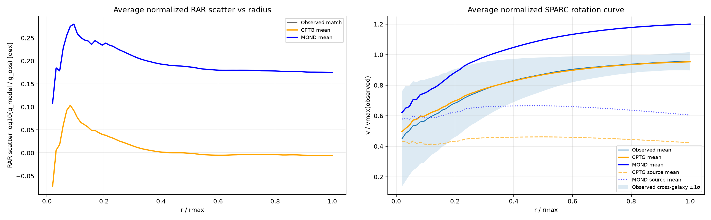
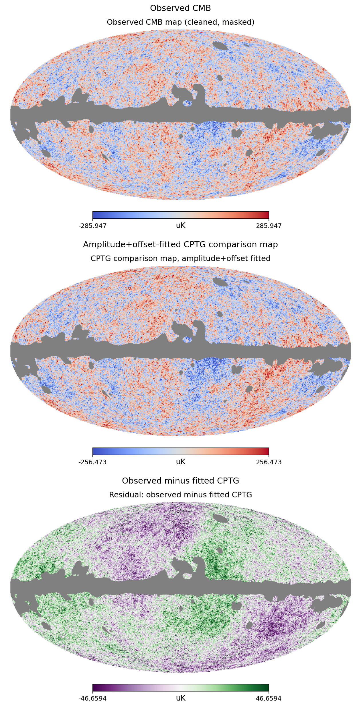

# CPTG

## Curvature Polarization Transport Gravity

---

## Contents

- [Core CPTG Papers](#start-here-core-cptg-papers)
- [Available Tools](#available-tools)
- [Overview](#overview)
- [Current Research Status](#current-research-status)
- [Repository Contents](#what-this-repository-contains)
- [Reproducing the Public Benchmarks](#reproducing-the-public-benchmarks)
- [CPTG SPARC Browser Workbench](#galaxy-scale-test-cptg-sparc-browser-workbench)
- [Curvature-Weighted Structural Mode Index](#curvature-weighted-structural-mode-index)
- [Outer-Slope Convergence Test](#outer-slope-convergence-test)
- [Bullet Cluster Benchmark](#cluster-merger-test-bullet-cluster-benchmark)
- [Cluster Active-Gate Test](#cluster-scale-active-gate-test-accept-and-x-cop)
- [Universal Geometric Nuclear-Reaction Theory](#universal-geometric-nuclear-reaction-theory)
- [Reaction Workbench and Exchange Interface](#reaction-workbench-and-exchange-interface)
- [Cosmology and Comparison-Layer Tests](#cosmology-and-comparison-layer-tests)
- [CPTG Research Position](#cptg-research-position)
- [Citation](#citation)

---

## Start Here: Core CPTG Papers

- **[Curvature Polarization Transport Gravity: A Unified Geometric Framework for Cosmic Structure and Expansion](https://raw.githubusercontent.com/CLG2025/CPTG/main/research/CPTG_Unified_Geometric_Framework_Cosmic_Structure_Expansion.pdf)**  
  Primary CPTG theory paper. This manuscript lays out the unified geometric framework: baryon-sourced curvature polarization, curvature transport, the cosmic/structure expansion connection, galaxy and cluster limits, and the broader comparison-layer program.

- **[CPTG Geometric π Branch Comparison Coordinates](https://raw.githubusercontent.com/CLG2025/CPTG/main/research/CPTG_Geometric_Pi_Branch_Comparison_Coordinates.pdf)**  
  Comparison-coordinate guide for the locked geometric π branch. This paper explains how CPTG-native quantities are mapped into observational coordinates for CMB, BAO, BBN, supernova, growth, and DESI-style comparison layers without treating those observational coordinates as the theory itself.

- **[The Science Behind CPTG: A Geometric Alternative to Dark Matter, Dark Energy, and MOND](https://raw.githubusercontent.com/CLG2025/CPTG/main/research/The_Science_Behind_CPTG.pdf)**  
  A public-facing introduction to Curvature Polarization Transport Gravity. This paper explains what makes CPTG different from dark matter, dark energy, and MOND-style approaches: baryon-sourced curvature polarization, curvature transport, structural modes, active gates, and scalable comparison coordinates derived from one geometric framework rather than sector-by-sector tuning.
  
- **[CPTG Geometric Nuclear Reaction Theory: Deuterium-Proton Radiative Capture](https://raw.githubusercontent.com/CLG2025/CPTG/main/research/CPTG_Geometric_Nuclear_Reaction_Theory.pdf)**  
  Commissioning-stage nuclear-reaction paper. It established the first complete CPTG source-to-reaction-to-rate-to-network chain for deuterium-proton capture, including the published source construction, closed-form S-factor comparison, transported BBN coordinate, and primordial mass-seven transport result.
  
---

## Available Tools

The repository provides public benchmark tools and active workbench projects:

- **CPTG academic package** — the compact reproducibility archive for the core SPARC galaxy and Bullet Cluster reduced-limit benchmarks.
- **CPTG SPARC Browser Workbench v1.12.0** — a larger standalone application for users focused on interactive SPARC rotation-curve analysis.
- **CPTG Reaction Workbench** — a PC-first nuclear-reaction interface in active development for deterministic calculation, comparison, project execution, evidence capture, replay, and external-model integration.

---

### CPTG SPARC Browser Workbench

The **CPTG SPARC Browser Workbench v1.12.0** is a local browser application distributed as a Windows release package and as Python source for supported Windows and Linux environments.

It analyzes the included SPARC galaxy rotation-curve files with CPTG and MOND. The workbench supports single-galaxy and batch analysis, primary/excluded/unmatched metadata views, rotation-curve and RAR plots, compact comparison tables, and optional saved result packages. Results are processed locally and are not retained unless the user explicitly enables file saving.

[View the interface](images/CPTG_SPARC_Browser_Workbench.png) · [Download v1.12.0](https://github.com/CLG2025/CPTG/releases/tag/v1.12.0)

---

### CPTG Pi-Bridge

CPTG Pi-Bridge is a local [research workbench](images/CPTG-Pi-Bridge-Local-Workbench.png) currently in beta development. It is designed to load public astronomy and cosmology datasets, select a CPTG comparison branch, run the audit engine, review results, and export reproducible validation packages.

Its translation layer uses the geometric-π comparison-coordinate method defined in the CPTG π-branch paper. CPTG-native quantities remain in their native geometric branch before being projected into conventional CMB, BAO, BBN, supernova, growth, and DESI-style comparison coordinates.

---

## Overview

*Curvature Polarization Transport Gravity* (CPTG) is an active geometric-gravity framework exploring whether effects commonly attributed to dark matter can arise from the response of spacetime curvature to ordinary baryonic matter.

CPTG is built around two linked mechanisms:

* **Curvature polarization**, which modifies the effective gravitational response according to the strength and structure of the field.
* **Curvature transport**, which allows organized curvature to be redistributed directionally in dynamic systems.

The framework is tested across galaxy rotation curves, cluster-merger lensing, relaxed galaxy clusters, cosmology-facing comparison layers, and a universal nuclear-reaction extension with a closed four-sector foundation spanning free nucleons, deuterium, mass three, and helium-4. The repository provides the current theory papers, CPTG SPARC Browser Workbench, included data, public figures, and reproducible validation materials for inspection, testing, and criticism.

---

## Current Research Status

CPTG is being developed as a geometric framework with reduced-limit tests and comparison-layer audits. The public status is best read by separating reproducible benchmarks, coordinate-layer validations, diagnostic passes, and active theory-development work.

| Area | Current CPTG status | Claim level |
|---|---|---|
| SPARC galaxy rotation curves | Public reduced-limit SPARC test available through the compact academic package and the interactive browser workbench | Reproducible galaxy-scale benchmark |
| Bullet Cluster merger plane | Public reduced merger-plane curvature-transport/lensing reconstruction | Reproducible cluster-merger benchmark |
| Cluster active-gate apertures | Same-aperture cluster-response tests using baryonic loading, support temperature, redshift, and aperture radius | Diagnostic cluster-scale active-gate and X-COP consistency [pass](#cluster-scale-active-gate-test-accept-and-x-cop) |
| Universal geometric nuclear-reaction theory | Closed four-sector foundation spanning free nucleons, deuterium, the mass-three pair, and helium-4, including ordered transport, exact conservation structure, and the complete transport-polarization source space | Universal [theory closure](#universal-geometric-nuclear-reaction-theory) with fixed-law, zero-refit transfer evidence in AlterBBN, PRyMordial, and PArthENoPE. The official PArthENoPE 3.0 campaign completed 695/695 full-network rows and passed the declared Reaction-20 D/H, He-3/H, and Li-7/H shared-endpoint gates across six density anchors. Separate clean-room native-physics reconstructions in **all three networks**—PArthENoPE, PRyMordial, and AlterBBN—then recovered the same rank-4 source architecture from each code's own native dynamics without inherited numerical response data, froze each construction before held-out execution, and passed all 6/6 held-out native validation rows across the same three preregistered density anchors under dual numerical profiles with no refit. This three-network reconstruction strengthens the derivational interpretation of the earlier transfer evidence while preserving code-local currents, Jacobians, source kernels, normalizations, trajectories, numerical operators, and solver details as implementation-specific. |
| Post-silicon nuclear continuation | Computational companion containing a gap-free archived mass-sector register from A=1 through A=119, with outward-boundary, temporal-convergence, source-isolation, and source-cutoff qualification | Reproducible exploratory continuation: robust reduced-graph reachability, not a precision-qualified primordial heavy-element prediction or finite physical endpoint |
| Nuclear-reaction interface and exchange layer | PC-first CPTG Reaction Workbench, deterministic evidence/replay architecture, formula-package authority, compiled-runtime boundary, and external scientific-model interface under active engineering development | Active engineering implementation and qualification |
| Pantheon+ supernova distances | Full-covariance relative distance-shape comparison with marginalized intercept | Distance-shape [pass](#pantheon-supernova-distance-shape-test), not an H0 calibration claim |
| BBN abundance and lithium tests | Transported BBN coordinate, locked live A = 7 lithium gate, PRyMordial admitted abundance row, AlterBBN rate-response marker, and the native D(p,γ)³He reaction-rate extension | Coordinate-layer and source-network [validation](#bbn-abundance-and-lithium-source-network-tests): deuterium and helium remain within their comparison bands while the A = 7 gate maps the raw standard-BBN lithium excess into the observed primordial lithium range |
| Weak-lensing S8 | Compressed comparison against representative weak-lensing and CMB S8 anchors | Diagnostic [pass](#weak-lensing-s8-comparison), not a full shear likelihood |
| CMB comparison-map closure | Locked geometric-π CMB branch tested against real Planck/WMAP temperature-map products and null controls | Real-map [comparison-map closure](#cmb-comparison-map-closure) pass |
| CMB Route B Option 1 bridge | Fixed amplitude-level curvature-transport bridge tested through CMB spectrum and Planck likelihood-coordinate plumbing | Geometry-first comparison-coordinate bridge [validation](#cmb-route-b-option-1-curvature-transport-bridge) |
| DESI compressed ShapeFit and BAO | Compressed-coordinate and ruler-wrapper diagnostics | Coordinate-level [support](#desi-dr1-compressed-shapefit-and-bao-quarter-ruler), not full raw DESI validation |
| Horizon and Hubble-tension mechanisms | Structural articles mapping CPTG-native branches into observational comparison layers | Theory [mechanism](#hubble-tension-bridge) and derivation-stage interpretation |

Claim levels are used consistently throughout this README:

- **Benchmark** — a reproducible reduced-limit calculation compared with data.
- **Diagnostic pass** — a result compatible with the stated controls.
- **Coordinate-layer validation** — a tested observational mapping or likelihood interface.
- **Closure pass** — agreement within a declared fixed-branch closure protocol.
- **Anchored comparison** — a dimensional comparison whose normalization is explicitly anchored to a stated observable, with independent rows treated as cross-checks rather than as free refits.
- **Theory closure** — the governing state structure, conservation laws, source space, and response architecture are fixed; remaining work concerns qualification, replication, implementation, and publication rather than structural retuning.
- **Fixed-law scalability** — the same geometric law, source-coordinate construction, conservation structure, and baryon-density dependence are carried across reaction channels and independently implemented scientific networks without reaction-specific or network-specific geometric refitting. Reaction stoichiometry selects the source direction; it does not replace the underlying CPTG law.
- **Cross-network transfer** — a fixed physical or geometric law reproduces its declared observable response in independently implemented scientific networks without network-specific refitting. This does not require equal code-local currents, normalizations, solvers, or secondary numerical residuals.
- **Clean-room reconstruction** — a source-to-observable operator is rebuilt from official network source under a declared prohibition on inherited numerical response data, frozen before held-out execution, and then tested without refitting. This is a derivational and native-physics qualification layer, distinct from the earlier full-network endpoint validation.
- **Pending qualification** — the governing structure and validation design are fixed, but the declared full-resolution execution or independent no-refit decision has not yet completed.
- **Exploratory continuation** — a result used to investigate extension beyond the validated domain; it does not establish universal physical validity in the extended sector.
- **Theory mechanism** — a derived interpretation connected to a dedicated comparison or audit layer.

---

## What This Repository Contains

This repository contains the public academic package for CPTG, including:

- current CPTG theory manuscripts and research notes,
- reduced benchmark scripts for galaxy and cluster tests,
- supporting public data packages and metadata when included,
- comparison-layer scripts and audit outputs when publicly included,
- universal nuclear-reaction theory material, immutable validation packages, protocol documents, source-network records, reproducibility evidence, and public reaction-interface materials when included,
- CMB source/data availability notes and strict rerun file lists,
- figures, summaries, and reproducibility material.

The recommended compact reproducibility download is **`CPTG_academic_package.zip`**, located in the **`/archive/`** folder. It preserves the public core benchmark environment for the SPARC galaxy and Bullet Cluster reduced-limit tests.

The larger **CPTG SPARC Browser Workbench v1.12.0** is distributed separately for interactive rotation-curve analysis. The release contains the prebuilt Windows application, local build and Python launch options, included SPARC data and metadata, and the current cross-platform Python source. Additional Python files in the repository should be treated as development variants or replacement implementations unless a specific package README states otherwise.

---

## Reproducing the Public Benchmarks

The public benchmarks are intended to be inspectable and reproducible.

1. Download or clone the repository.
2. Open the **`/archive/`** folder.
3. Use **`CPTG_academic_package.zip`** for the public benchmark package.
4. Extract the archive into a working folder.
5. Run the benchmark scripts with Python 3.
6. Compare generated outputs against the included figures and summary files.

The package root directory may be renamed freely. Reproducibility depends on preserving the internal relative layout, or on passing explicit input/output paths when running scripts. Planck and WMAP FITS products are not bundled with CMB map-closure packages; they must be placed in the documented data location or supplied by command-line path.

The main public benchmark scripts are:

| Package or tool | Purpose |
|---|---|
| `SPARC_CPTG_MOND_Benchmark.py` | Original galaxy rotation-curve benchmark against SPARC data. |
| `CPTG_Bullet_Cluster_Merger.py` | Reduced merger-plane curvature-transport/lensing benchmark. |
| `CPTG_ClusterActiveGate_IntegratedTool_v0_5.py` | Single-aperture and aperture-ladder cluster-response calculations from baryonic loading, support temperature, redshift, and aperture. Requires the [public X-COP cluster archive](https://drive.switch.ch/index.php/s/j3WUOYXWgv9Jbnz/download). |
| `CPTG_MOND_Upsilon_SPARC_Benchmark.py` | MOND/CPTG comparison with stellar mass-to-light freedom. |
| `CPTG-CMB.zip` | CMB comparison-map closure scripts for Planck/WMAP component maps, split maps, smoothing/mask controls, visual comparisons, summary reports, and null-envelope controls. |

---

## Galaxy-Scale Test: CPTG SPARC Browser Workbench

The recently updated **CPTG SPARC Browser Workbench v1.12.0** provides a local browser interface for testing CPTG and MOND against SPARC galaxy rotation-curve data.

The standalone [release package](https://github.com/CLG2025/CPTG/releases/tag/v1.12.0) includes the SPARC galaxy files and metadata needed to begin running analyses immediately. It supports:

- searchable single and multi-galaxy selection,
- individual-galaxy and batch analysis,
- metadata views for all, primary, excluded, and unmatched galaxies,
- primary-sample filtering when a metadata file is active,
- CPTG and MOND rotation-curve comparisons,
- averaged normalized rotation curves,
- averaged RAR scatter versus radius,
- compact result tables reporting total points, total χ², χ² per point, RMS residuals, and mean observed/model velocities,
- galaxy-level fit and Curvature-Weighted Structural Mode Index summaries,
- optional CSV, JSON, PNG, and ZIP output saving.

All calculations are performed locally. Each galaxy is solved independently before aggregate statistics and plots are generated. By default, completed analyses are displayed in the browser without retaining a run folder. Output files are written under `/runs/` only when the user explicitly selects **Save result files**.

When metadata is enabled, the galaxy list defaults to the primary sample while preserving the user's previous metadata-view selection during the browser session. Primary, excluded, and unmatched galaxies remain separately identifiable, and checked galaxies from any active view can be processed.

For aggregate plots, each galaxy is normalized independently and interpolated onto a shared normalized radial grid. Each galaxy receives equal weight at each grid location, and the outer endpoint at `r / r_max = 1` is retained.

[SPARC data source](https://astroweb.case.edu/SPARC/): Lelli, McGaugh, and Schombert, *The Astronomical Journal* 152, 157 (2016), [“SPARC: Mass Models for 175 Disk Galaxies with Spitzer Photometry and Accurate Rotation Curves”](https://ui.adsabs.harvard.edu/abs/2016AJ....152..157L/abstract).

The figure below summarizes averaged SPARC results produced by the workbench.



<sup>Figure: CPTG SPARC Browser Workbench averaged results for the full 175-galaxy SPARC run. Primary-sample metadata filtering was not applied to this figure.</sup>

---

## Curvature-Weighted Structural Mode Index

The Curvature-Weighted Structural Mode Index, **N**, is a CPTG diagnostic derived from the solved acceleration field.

It measures how curvature support is organized inside a galaxy:

**N = R / λ**

where:

* **R** is the outer solved radius.
* **λ** is the curvature-weighted structural scale.

The workbench translates the continuous mode value into a named **CSMI Type**:

| Structural Mode N | CSMI Type             |
| ----------------: | --------------------- |
|          N ≤ 1.45 | Dwarf Irregular       |
|   1.45 < N ≤ 1.75 | Magellanic Irregular  |
|   1.75 < N ≤ 1.95 | LSB Dwarf Disk        |
|   1.95 < N ≤ 2.15 | Transition Dwarf      |
|   2.15 < N ≤ 2.35 | LSB Spiral            |
|   2.35 < N ≤ 2.55 | Very Late Spiral      |
|   2.55 < N ≤ 2.80 | Late Spiral           |
|   2.80 < N ≤ 3.05 | Intermediate Spiral   |
|   3.05 < N ≤ 3.30 | Early Spiral          |
|   3.30 < N ≤ 3.55 | Bulged Spiral         |
|   3.55 < N ≤ 3.72 | Lenticular/Early Disk |
|          N > 3.72 | High-Mode Outlier     |

The CSMI Type is assigned only from the solved mode value. It is not taken from galaxy names, SPARC metadata, catalog morphology, or visual classification. As larger and more diverse galaxy samples are analyzed, future CSMI catalogs will likely expand, subdivide, or refine the named structural types to represent newly resolved mode populations. Any additional categories would remain derived from the solved CPTG mode distribution rather than being imposed from conventional morphological classifications.

Mode-filtered runs allow galaxies with similar CPTG structural organization to be evaluated as subsets of the full database.

In public-facing terms, **N** asks:

> How is the solved curvature structure organized inside this galaxy?

This makes the mode and its CSMI Type theory-derived structural diagnostics rather than conventional galaxy classifications.

---

## Outer-Slope Convergence Test

The CPTG outer-slope convergence test evaluates a theory-defined prediction of the reduced galaxy equation: once the solved field is extended beyond the outermost measured SPARC radius, the rotation-curve response should approach a stable CPTG outer-regime trend rather than drift arbitrarily.

This is an important strength of CPTG because the far-outer behavior follows from the solved curvature-polarization and transport structure. It is not independently fitted to artificial outer data points.

The purpose of the test is not to claim that current observations already measure the entire extended regime. It checks whether the reduced CPTG galaxy equation develops the stable long-range behavior predicted by the theory when continued beyond the observed rotation-curve domain.

In CPTG, weak-field galaxy outskirts should gradually approach a consistent curvature-polarization pattern. The convergence plot visualizes that prediction across the SPARC galaxy sample.

The second benchmark figure shows the stacked CPTG outer-slope convergence trend for the SPARC galaxy sample.


<sup>Figure: CPTG outer-slope convergence in the extended galaxy-outskirts regime.</sup>

---

## Cluster-Merger Test: Bullet Cluster Benchmark

The **`CPTG_Bullet_Cluster_Merger.py`** script tests the cluster-merger limit of the theory through a reduced Bullet Cluster merger-plane implementation.

It constructs baryonic gas and galaxy components, builds curvature-polarization background fields, evolves a transported-curvature mode, and produces a normalized convergence/kappa reconstruction.

The model is scored against observed Bullet Cluster gas, galaxy, and lensing separations, including:

- Bullet-side mass-galaxy offset,
- Bullet-side mass-ICM offset,
- main-cluster north mass-ICM offset,
- main-cluster south mass-ICM offset,
- main-subclump separation,
- cluster-scale lensing separation.

### Primary JWST and lensing benchmark reference

The primary high-resolution observational reference used for the Bullet Cluster mass-map interpretation and offset benchmarks in this reduced model is:

> Cha, S., Cho, B. Y., Joo, H., Lee, W., HyeongHan, K., Scofield, Z. P., Finner, K., & Jee, M. J. (2025), “[A High-Caliber View of the Bullet Cluster through JWST Strong and Weak Lensing Analyses](https://arxiv.org/abs/2503.21870),” *The Astrophysical Journal Letters*, **987**, L15.

The CPTG benchmark uses this study for:

- the high-resolution JWST mass-map interpretation;
- the Bullet subcluster mass-galaxy offset benchmark of **17.78 ± 0.66 kpc**;
- the Bullet mass-ICM offset target of approximately **150 kpc**;
- the main-cluster north and south mass-ICM offset targets of approximately **200 kpc** and **400 kpc**;
- the interpretation that the main cluster contains resolved north/south substructure and that the merger geometry is more complex than a simple binary-merger picture.

The public significance of this test is that CPTG attempts to address not only galaxy rotation curves, but also dissociative cluster mergers, which are often considered strong evidence for collisionless dark matter.

---

The third benchmark figure shows how CPTG reconstructs displaced lensing structure in the Bullet Cluster merger plane.

![Normalized CPTG kappa reconstruction of the Bullet Cluster merger plane. The map shows two main convergence structures: a compact Bullet-side lensing feature on the left, displaced from the Bullet gas peak, and a larger main-cluster lensing structure on the right with north and south substructure. White contours trace the strongest reconstructed convergence regions. Markers identify Bullet and main gas peaks, galaxy peaks, lensing peaks, and main-cluster north/south lens peaks. A scale bar marks 100 kpc.](images/CPTG-Curvature-Transport-Model.png)

<sup>Figure: CPTG Bullet Cluster kappa reconstruction showing gas-lensing separation.</sup>

---

## Cluster-Scale Active-Gate Test: ACCEPT and X-COP

The [cluster-scale active-gate](https://raw.githubusercontent.com/CLG2025/CPTG/main/research/CPTG_Cluster-Scale_Active-Gate_Extension.pdf) work extends CPTG beyond galaxy rotation curves and reduced merger-plane reconstruction into relaxed or approximately coherent galaxy-cluster apertures. The calculation asks whether a cluster aperture can be described by baryonic loading, support temperature, redshift, and aperture radius through one active curvature-response state.

For a selected aperture `R_delta`, the calculation uses gas mass, stellar/intracluster-light support where available, temperature, redshift, and aperture radius to compute the active-gate response and the predicted CPTG mass for the same aperture.

This work provides a same-aperture test of both the accuracy and structural response of the CPTG cluster active-gate law. Across the tested 12-cluster X-COP R₅₀₀ sample, the predicted CPTG masses achieved a median CPTG-to-hydrostatic mass ratio of 0.9892, corresponding to a median absolute fractional difference of approximately 1.08%. The mean absolute difference was approximately 1.19%, and the largest individual difference was approximately 2.68%. The X-COP aperture ladder further reproduced the predicted transition from closure-stable inner apertures to greater active-gate sensitivity at R₅₀₀. Independently, the ACCEPT analysis ordered 379 clean profile rows across 45 clusters into the expected closure-stable, watch, suppressed, and strongly suppressed response states. Together, these results show that the same fixed CPTG law produces percent-level same-aperture mass agreement while also recovering the theory-defined structural ordering of cluster apertures.

This result should be read as a diagnostic cluster-scale active-gate pass and an X-COP same-aperture consistency pass. It is not a claim that one single-aperture formula describes strong cluster mergers without decomposition. Strong mergers are best treated separately unless gas, stellar, temperature, and mass components can be assigned consistently to the same dynamical aperture.

---

## Universal Geometric Nuclear-Reaction Theory

CPTG has transitioned from a commissioned deuterium-proton capture model to a universal geometric nuclear-reaction theory with a validated four-sector foundation:

- **Free nucleons (`n`, `p`) — vertex**
- **Deuterium — bridge**
- **Mass three (`³H`, `³He`) — closure**
- **Helium-4 (`⁴He`) — saturation**

These sectors form one ordered transport-polarization architecture rather than four unrelated reaction constructions. They are the demonstrated foundation of the theory, not an asserted upper mass limit.

### Architecture and closure

The dynamic vertex contains free neutrons and protons; deuterium supplies the first bound bridge; tritium and helium-3 form two charge orientations of the mass-three closure sector; and helium-4 is the saturated endpoint. The theory separates:

- **ordered transport**, which moves baryonic content through vertex, bridge, closure, and saturation;
- **internal polarization**, which preserves the neutron-proton and tritium-helium-3 orientation required by charge conservation.

Structural closure fixes the physical coordinate, baryon and charge constraints, transport and polarization directions, reaction-source basis, curvature-response hierarchy, separation of direct source current from final network response, and the fail-closed construction, validation, evidence, and replay architecture. New reaction channels are treated as projections through this common geometry rather than as independent fitted constructions.

### Fixed-law scalability

CPTG scalability does not require different network codes to produce numerically identical internal currents, source kernels, integration measures, or solver trajectories. It means that the same geometric law, source-coordinate construction, conservation structure, and baryon-density dependence are carried across reaction channels and independent implementations without introducing a separately fitted geometric rule for each reaction or code. Reaction stoichiometry changes the source direction inside the common transport-polarization space; it does not change the underlying CPTG geometry.

### Commissioning foundation

The published *[Geometric Nuclear Reaction Theory in CPTG: Deuterium-Proton Capture and Primordial Mass-Seven Transport](https://raw.githubusercontent.com/CLG2025/CPTG/main/research/CPTG_Geometric_Nuclear_Reaction_Theory.pdf)* remains the valid commissioning-stage foundation for the present program. It carried the `D(p,γ)³He` channel from an explicit native A=3 source-state construction through a coherent reaction amplitude, a closed-form astrophysical S-factor, a thermonuclear-rate interface, a transported BBN coordinate, and the live primordial mass-seven transport calculation.

The commissioning paper reported a zero-energy S-factor comparison at **−0.149960σ**, a solar-Gamow comparison at approximately **−0.02043σ**, a PRyMordial gated-lithium result at **+0.90593σ** while preserving the deuterium and helium controls, and an AlterBBN high-precision rate-response marker at **+1.15975σ** under the same published mass-seven transport rule.

That paper was intentionally reaction-specific. Its role was to demonstrate that one nuclear channel could be constructed geometrically and propagated all the way into conventional nuclear and abundance observables. The universal program asks the stronger question: whether that success is a projection of one common transport-polarization architecture rather than a separate geometric construction for every reaction. The published commissioning formulas and results are public; the unreleased universal reaction formulas remain reserved for the final universal paper.

### Cross-network validation

The commissioned Reaction-20 response now has no-refit transfer evidence in three independently developed BBN implementations:

| Network | Established result | Authority boundary |
|---|---|---|
| [AlterBBN v2](https://doi.org/10.1016/j.cpc.2019.106982) | Native Reaction-20 response surface and endpoint propagation, followed by a clean-room native-physics reconstruction using AlterBBN's native abundance linearization and direct selected-reaction mass-action source currents; the frozen rank-4 construction passed 6/6 held-out native rows across three density anchors under dual numerical profiles | Completed AlterBBN native-physics reconstruction; currents, Jacobians, trajectories, normalization conventions, solver behavior, and the numerical operator remain code-local and are not asserted to be identical across networks |
| [PRyMordial](https://doi.org/10.1140/epjc/s10052-024-12442-0) | Independent matched-uniform Reaction-20 endpoint and current-normalized response, followed by a clean-room native-physics reconstruction that recovered the rank-4 source-to-observable architecture and passed 6/6 held-out native rows across three density anchors under dual numerical profiles | Completed PRyMordial native-physics reconstruction; current normalization, native trajectories, Jacobians, and solver-local quantities remain code-local and are not asserted to be numerically identical across networks |
| [PArthENoPE 3.0](https://doi.org/10.1016/j.cpc.2021.108205) | Official full-network 695-row endpoint campaign with 338/338 matched pairs and 84/84 complete ladders, followed by a separate clean-room reconstruction that recovered the rank-4 source-to-observable response and passed 6/6 held-out native rows across three density anchors under dual integration profiles | Completed zero-refit shared-endpoint validation plus a deeper clean-room native-physics reconstruction; no claim of cross-code equality of internal currents, source kernels, or solver-local quantities |

These codes share portions of the underlying BBN physics and nuclear-rate literature. The result is therefore described as cross-network transfer without network-specific refitting, not as three independent Bernoulli trials or evidence of identical internal-current normalization.

#### Full-network PArthENoPE Reaction-20 validation

The official PArthENoPE 3.0 campaign used the complete 26-nuclide/100-reaction network, one native process per row, symmetric logarithmic rate branches, full trajectory retention, atomic progress commits, matched-pair auditing, and complete-ladder auditing.

| Validation metric | Measured result | Declared requirement |
|---|---:|---:|
| Native rows | 695/695 | 695/695 |
| Matched branch pairs | 338/338 | 338/338 |
| Complete eight-branch ladders | 84/84 | 84/84 |
| Reaction-20 direction cosine | 0.999979437501036 | at least 0.995 |
| D/H component ratio | 0.998516625 | 0.85 to 1.15 |
| He-3/H component ratio | 0.993911268 | 0.85 to 1.15 |
| Li-7/H component ratio | 1.008589280 | 0.85 to 1.15 |
| Maximum six-anchor variation | 2.491% | no more than 10% |

The accepted evidence chain is bound in:

```text
CPTG_v129_r109_PArthENoPE_CPTG_Reaction20_ReplicationAuthorityBundle_20260731_r02.zip
SHA-256: 3d42d1cb1d710248841db8d7b1ceafcc7569f092b9b35c9f4114ce9615074cfc
Verification command: RUN_VERIFY_AND_REGENERATE_WINDOWS.cmd
```

The bundle combines the campaign source, 695 accepted native rows, recomputation source code, provenance records, six anchor vectors, threshold calculations, claim matrix, and one-command audit regeneration. The official PArthENoPE distribution is obtained separately under [Mendeley Data DOI 10.17632/wvgr7d8yt9.2](https://doi.org/10.17632/wvgr7d8yt9.2).

This is a completed **zero-refit cross-network validation** of the fixed Reaction-20 shared-endpoint response in a third independently developed BBN implementation. It establishes transfer of the declared observable response while leaving code-local internals implementation-specific. It does not establish equality of code-local currents, an AlterBBN source-kernel identity inside PArthENoPE, a complete five-coordinate susceptibility reconstruction, or validation across every reaction channel.

#### Clean-room PArthENoPE native-physics reconstruction

After the 695-row full-network validation was already complete, a separate clean-room PArthENoPE campaign was used to investigate the underlying native reaction physics more directly. The purpose was not to validate PArthENoPE for the first time, but to determine whether the fixed observable response could be reconstructed again from official source and fixed CPTG geometric rules without relying on the numerical response history that had produced the earlier endpoint result.

The clean-room construction excluded previous numerical response vectors, previous numerical operator matrices, previous Jacobian histories, previous source histories, previous native trajectories, and previous PASS/FAIL decisions as construction inputs. The source-to-observable operator was reconstructed at the acoustic construction anchor, independently qualified under two integration profiles, and frozen before any held-out validation execution. The frozen operator was then tested without refitting at three preregistered baryon-density conditions: two interior anchors and the physical BBN endpoint.

| Clean-room metric | Result | Declared requirement |
|---|---:|---:|
| Exact-core source-space rank | **4** | rank 4 |
| Held-out native validation rows | **6/6 PASS** | 6/6 |
| Held-out density anchors | **3/3 PASS** | 3/3 |
| Integration profiles per anchor | **2/2 PASS** | 2/2 |
| Worst dual-profile core-4 relative difference | **0.4128%** | no more than 3% |
| Worst dual-profile core-4 direction difference | **0.2207°** | no more than 1° |
| Worst frozen-operator core-4 relative error | **1.1143%** | no more than 3% |
| Worst frozen-operator core-4 direction error | **0.4965°** | no more than 1° |
| Worst individual-reaction relative error | **1.7098%** | no more than 3% |
| Worst mass-seven polarization relative error | **1.6095%** | no more than 3% |
| Mass-seven polarization sign agreement | **100%** | required |

The accepted clean-room evidence chain is bound in:

```text
CPTG_PARTHENOPE_CLEANROOM_FINAL_RESULTS.zip
SHA-256: 8d503dd80036e6917500ca8367d8830d727930a23e8779fa3497bf9c1cf4d903
Construction freeze SHA-256: 770139cfb7b98f5c0cf6e5a038ea32aee4fb8c3430ed6fb02f38292221fe63d3
```

The construction freeze is the same authority object used during held-out validation, so the observable operator was not altered after the validation targets became available. The result therefore strengthens the physical interpretation of the earlier full-network PArthENoPE success: the fixed response can be reconstructed from native reaction-source behavior and transferred across held-out density conditions rather than treated only as a retrospectively successful endpoint pattern. This clean-room result remains a PArthENoPE-native derivational qualification; cross-network universality continues to rely on the separate AlterBBN and PRyMordial evidence layers.

#### Clean-room PRyMordial native-physics reconstruction

Following the earlier PRyMordial transfer result, a separate clean-room campaign applied the same construction-freeze-held-out discipline used in PArthENoPE to the native PRyMordial network. The objective was not to repeat the earlier endpoint result, but to determine whether the source-to-observable response could be rebuilt directly from native network dynamics without importing the numerical response history that had produced the previous transfer evidence.

The construction used a pristine hash-bound PRyMordial source tree, unperturbed native trajectories, native analytic Jacobians, cancellation-free local reaction-source isolation, and direct variational propagation. No integrated rate-perturbed response rows were used. Previous PRyMordial response vectors, previous numerical operator matrices, previous native rows, and previous PASS/FAIL decisions were excluded as construction inputs. The rank-4 operator was reconstructed at the acoustic construction anchor, independently qualified under two numerical profiles, frozen before held-out execution, and then tested without refitting at the same three preregistered baryon-density conditions used for the PArthENoPE clean-room test.

| PRyMordial clean-room metric | Result | Declared requirement |
|---|---:|---:|
| Exact-core source-space rank | **4** | rank 4 |
| Held-out native validation rows | **6/6 PASS** | 6/6 |
| Held-out density anchors | **3/3 PASS** | 3/3 |
| Numerical profiles per anchor | **2/2 PASS** | 2/2 |
| Worst frozen-operator core-4 relative error | **1.184957%** | no more than 3% |
| Worst frozen-operator core-4 direction error | **0.496262°** | no more than 1° |
| Worst individual-reaction relative error | **1.801701%** | no more than 3% |
| Worst individual-reaction direction error | **0.425239°** | no more than 1° |
| Worst mass-seven polarization relative error | **1.831870%** | no more than 3% |
| Mass-seven polarization sign agreement | **100%** | required |
| Worst dual-profile core-4 relative difference | **9.71 × 10⁻⁸** | no more than 3 × 10⁻² |
| Worst dual-profile core-4 direction difference | **5.33 × 10⁻⁶°** | no more than 1° |
| Worst local-source stoichiometric alignment error | **1.48 × 10⁻⁶°** | no more than 0.01° |

The accepted PRyMordial clean-room evidence chain is bound in:

```text
CPTG_PRYMORDIAL_CLEANROOM_FINAL_RESULTS.zip
SHA-256: b1810b1332fbb859437e15bbde3583330ec97456341f690b7f64b2948cfd3ba3
Construction freeze SHA-256: e617fcbad9ff2db1edbc443c16348f67e7f7c197fa64503971c91dce862f72b0
```

The frozen construction in the final evidence is byte-identical to the authority object created before held-out execution. All six held-out rows were baseline native calculations; the campaign used **zero integrated perturbed response rows**, **zero inherited PRyMordial numerical-response inputs**, and **zero response-fit parameters**. The numerical-profile agreement is many orders of magnitude tighter than the held-out transfer gate, separating the observed percent-level density transfer from numerical-resolution noise.

#### Clean-room AlterBBN native-physics reconstruction

A third clean-room campaign then applied the same construction-freeze-held-out discipline to AlterBBN. The purpose was again derivational rather than merely endpoint-based: to ask whether the rank-4 source-to-observable response could be reconstructed from AlterBBN's own native reaction dynamics, frozen before the held-out density conditions were opened, and transferred without refitting.

The AlterBBN reconstruction used baseline native trajectories only. The campaign instrumented AlterBBN's native abundance linearization to recover the local abundance Jacobian and captured the selected reactions' forward-minus-reverse mass-action source currents directly inside the native reaction loop. Those native states, Jacobians, and source histories were then propagated through the direct variational system to produce the five-coordinate observable response. The construction used **zero inherited AlterBBN numerical-response inputs**, **zero integrated rate-perturbation rows**, and **zero response-fit parameters**.

| AlterBBN clean-room metric | Result | Declared requirement |
|---|---:|---:|
| Exact-core source-space rank | **4** | rank 4 |
| Held-out native validation rows | **6/6 PASS** | 6/6 |
| Held-out density anchors | **3/3 PASS** | 3/3 |
| Numerical profiles per anchor | **2/2 PASS** | 2/2 |
| Worst frozen-operator core-4 relative error | **1.702710%** | no more than 3% |
| Worst frozen-operator core-4 direction error | **0.489773°** | no more than 1° |
| Worst individual-reaction relative error | **2.032355%** | no more than 3% |
| Worst individual-reaction direction error | **0.532337°** | no more than 1° |
| Worst mass-seven polarization relative error | **2.776521%** | no more than 3% |
| Mass-seven polarization sign agreement | **100%** | required |
| Worst dual-profile core-4 relative difference | **0.398748%** | no more than 3% |
| Worst dual-profile core-4 direction difference | **0.148025°** | no more than 1° |
| Worst local-source stoichiometric alignment error | **1.71 × 10⁻⁶°** | no more than 0.01° |

The accepted AlterBBN clean-room evidence chain is bound in:

```text
CPTG_ALTERBBN_CLEANROOM_FINAL_RESULTS.zip
SHA-256: de4777d766792f04fffbd9c415f7e4cd52259f1303f308320fb8b338ef216169
Construction freeze SHA-256: ca208f05cb061de7883111ba29019333a6b0fc92b03ec7078cb013d9cc5b9dba
```

The construction freeze in the final archive is byte-for-byte identical to the authority object audited before validation. All eight native rows—two construction and six held-out validation rows—completed with finite 513-point state, Jacobian, and source histories. Independent reintegration of the held-out direct variational system regenerated the archived q5 responses to approximately **1 × 10⁻¹¹ relative precision**. The tightest declared transfer margin is the mass-seven polarization response at **2.776521%** against the **3%** preregistered gate; it passes with correct sign at every tested anchor but is reported here explicitly because it is the narrowest margin in the three-network clean-room program.

PArthENoPE, PRyMordial, and AlterBBN therefore now provide **three independently implemented native-network reconstructions** with the same qualitative result: the rank-4 geometric source architecture can be recovered from each code's native reaction dynamics and its construction-frozen observable response can transfer prospectively across held-out baryon density without network-specific refitting. This does **not** assert equality of the numerical operator matrices, current normalizations, Jacobians, trajectories, source kernels, or solver internals. Those quantities remain implementation-specific.

### Continuing validation and extension

A separate six-anchor Reaction-21 reserve-channel result supports transfer beyond the commissioning reaction without changing the fixed operator. With the full-network PArthENoPE validation and clean-room native-physics reconstructions now complete in PArthENoPE, PRyMordial, and AlterBBN, the three-network derivational qualification stage is closed. The remaining nuclear program is therefore focused on evidence consolidation, final-paper integration, reserve-channel and beyond-foundation extension tests, and reproducible tooling rather than reopening the completed clean-room authorities.

A separate computational companion extends the represented reduced graph beyond the native silicon-30 frontier. Its archived mass-sector register is continuous from A=1 through A=119 and stable through the declared boundary and temporal-refinement checks. This is reproducible reduced-graph reachability, not native-network coverage beyond silicon-30, a precision primordial heavy-element prediction, or a finite physical endpoint. The [computational companion](https://raw.githubusercontent.com/CLG2025/CPTG/main/nuclear-reactions/universal-theory/Complete-Processed-Nuclear-Chain.pdf) and its evidence package are maintained together.

### Why this matters

The result gives CPTG one nuclear-reaction language for primordial networks, reaction-rate comparison, sensitivity calculations, plasma-state evaluation, deterministic evidence and replay, and external scientific-model integration. CPTG supplies scientific reaction quantities and comparison coordinates; facility integration, control systems, actuators, and safety certification remain the responsibility of the implementing institution.

### Reaction Workbench and Exchange Interface

The CPTG Reaction Workbench is being developed as a deterministic interface for approved reaction formula and coefficient packages, comparison projects, evidence capture, replay, and external-model integration without repeating the full qualification campaign for every query.

### Public disclosure boundary

The formulas and numerical results of the published commissioning-stage `D(p,γ)³He` and primordial mass-seven work are public and may be reproduced or discussed in this repository. The governing equations, coefficient payloads, source operators, and closed-form reaction laws of the **current universal geometric nuclear-reaction theory** are intentionally not listed in this README. The final universal paper will present those equations together with their derivation, physical interpretation, validation protocol, and accepted evidence chain.

Current public materials, immutable packages, protocols, computational companions, and future manuscript releases are maintained in the **[`/nuclear-reactions/`](https://github.com/CLG2025/CPTG/tree/main/nuclear-reactions)** directory.

### BBN software citations

- A. Arbey, J. Auffinger, K. P. Hickerson, and E. S. Jenssen, “AlterBBN v2: A public code for calculating Big-Bang nucleosynthesis constraints in alternative cosmologies,” *Computer Physics Communications* **248**, 106982 (2020), [doi:10.1016/j.cpc.2019.106982](https://doi.org/10.1016/j.cpc.2019.106982).
- A.-K. Burns, T. M. P. Tait, and M. Valli, “PRyMordial: the first three minutes, within and beyond the standard model,” *The European Physical Journal C* **84**, 86 (2024), [doi:10.1140/epjc/s10052-024-12442-0](https://doi.org/10.1140/epjc/s10052-024-12442-0).
- S. Gariazzo, P. F. de Salas, O. Pisanti, and R. Consiglio, “PArthENoPE revolutions,” *Computer Physics Communications* **271**, 108205 (2022), [doi:10.1016/j.cpc.2021.108205](https://doi.org/10.1016/j.cpc.2021.108205).

---

## Cosmology and Comparison-Layer Tests

CPTG cosmology-facing work is organized around the distinction between CPTG-native geometric quantities and conventional observational summaries. The goal is not to force CPTG into standard parameter language, but to make controlled comparisons with quantities commonly reported from supernova, CMB, abundance, growth, and large-scale-structure analyses.

### Current Locked Geometric π Branch

The current locked CPTG comparison branch uses:

```text
p_C = pi
p_ac = 3 - pi/100 = 2.968584073464
G_T = p_ac / p_C = 0.944929658551
sqrt(G_T) = 0.972074924351
H0^(pi) = 69.4162507897 km s^-1 Mpc^-1
H0_CMB^CPTG = 67.4777967351 km s^-1 Mpc^-1
A_lens = 1
```

The locked CMB comparison-map row used in the current Planck/WMAP map-space closure paper is:

```text
H0 = 67.4777967351 km s^-1 Mpc^-1
omega_b h^2 = 0.022527857494
omega_c h^2 = 0.117685841620526
n_s = 0.968584073464
N_eff = 2.968584073464
A_s = 2.136283004441e-9
tau = 0.058930875934
A_lens = 1
```

These values define the fixed geometric-π CMB branch used in the current comparison-map closure audits. The branch is locked before the map tests and is not refit to the individual CMB maps.

### CMB Comparison-Map Closure

CPTG CMB map work is organized as a [real-map comparison test](https://raw.githubusercontent.com/CLG2025/CPTG/main/research/CPTG_CMB_Comparison_Map_Closure.pdf) between the locked geometric-π CMB branch and public CMB map products. The current paper uses real Planck component maps, Planck split maps, and WMAP low-ell support products.



<sup>Figure: SMICA visual comparison from the CMB comparison-map closure paper. Top: observed Planck SMICA temperature map. Center: fitted CPTG comparison map. Bottom: observed-minus-fitted-CPTG residual.</sup>

The map-space procedure uses the same comparison coordinate for CPTG, the Planck envelope, and controls. It reads the temperature field from the public CMB map product, applies the documented mask, converts to microkelvin, downgrades to `Nside = 256`, removes the monopole and dipole on the valid sky, and evaluates fitted residuals under the same amplitude-plus-offset rule:

```text
T_fit(nhat) = A T_template(nhat) + B
```

The central public result is that the locked CPTG geometric-π branch reaches near-degenerate CMB comparison-map closure with the Planck comparison envelope across the tested real-map products and controls, while generic null envelopes fail much more strongly under the same map-space procedure. The detailed RMS tables, control ladders, and null-envelope audits are contained in the dedicated CMB comparison-map closure material.

#### Original Planck and WMAP FITS Inputs

The original Planck and WMAP survey FITS maps are **not bundled** because they are large public data products. For the strict CMB comparison-map closure rerun, use only the tested FITS inputs below. Do not add optional masks, alternate survey products, or substitute component maps to the control environment.

| Test layer | Required local filename | Public source |
|---|---|---|
| Planck SMICA full map | [`COM_CMB_IQU-smica_2048_R3.00_full.fits`](https://irsa.ipac.caltech.edu/data/Planck/release_3/all-sky-maps/maps/component-maps/cmb/COM_CMB_IQU-smica_2048_R3.00_full.fits) | Planck R3 / IRSA |
| Planck SMICA-noSZ full map | [`COM_CMB_IQU-smica-nosz_2048_R3.00_full.fits`](https://irsa.ipac.caltech.edu/data/Planck/release_3/all-sky-maps/maps/component-maps/cmb/COM_CMB_IQU-smica-nosz_2048_R3.00_full.fits) | Planck R3 / IRSA |
| Planck NILC full map | [`COM_CMB_IQU-nilc_2048_R3.00_full.fits`](https://irsa.ipac.caltech.edu/data/Planck/release_3/all-sky-maps/maps/component-maps/cmb/COM_CMB_IQU-nilc_2048_R3.00_full.fits) | Planck R3 / IRSA |
| Planck SEVEM full map | [`COM_CMB_IQU-sevem_2048_R3.00_full.fits`](https://irsa.ipac.caltech.edu/data/Planck/release_3/all-sky-maps/maps/component-maps/cmb/COM_CMB_IQU-sevem_2048_R3.00_full.fits) | Planck R3 / IRSA |
| Planck Commander full map | [`COM_CMB_IQU-commander_2048_R3.00_full.fits`](https://irsa.ipac.caltech.edu/data/Planck/release_3/all-sky-maps/maps/component-maps/cmb/COM_CMB_IQU-commander_2048_R3.00_full.fits) | Planck R3 / IRSA |
| Planck SMICA half-mission 1 | [`COM_CMB_IQU-smica_2048_R3.00_hm1.fits`](https://irsa.ipac.caltech.edu/data/Planck/release_3/all-sky-maps/maps/component-maps/cmb/COM_CMB_IQU-smica_2048_R3.00_hm1.fits) | Planck R3 / IRSA |
| Planck SMICA half-mission 2 | [`COM_CMB_IQU-smica_2048_R3.00_hm2.fits`](https://irsa.ipac.caltech.edu/data/Planck/release_3/all-sky-maps/maps/component-maps/cmb/COM_CMB_IQU-smica_2048_R3.00_hm2.fits) | Planck R3 / IRSA |
| Planck SMICA odd-ring split | [`COM_CMB_IQU-smica_2048_R3.00_oe1.fits`](https://irsa.ipac.caltech.edu/data/Planck/release_3/all-sky-maps/maps/component-maps/cmb/COM_CMB_IQU-smica_2048_R3.00_oe1.fits) | Planck R3 / IRSA |
| Planck SMICA even-ring split | [`COM_CMB_IQU-smica_2048_R3.00_oe2.fits`](https://irsa.ipac.caltech.edu/data/Planck/release_3/all-sky-maps/maps/component-maps/cmb/COM_CMB_IQU-smica_2048_R3.00_oe2.fits) | Planck R3 / IRSA |
| WMAP 9-year ILC map | [`wmap_ilc_9yr_v5.fits`](https://lambda.gsfc.nasa.gov/data/map/dr5/dfp/ilc/wmap_ilc_9yr_v5.fits) | NASA LAMBDA |

The Planck rows use the temperature fields and embedded mask fields declared by the CMB scripts. The WMAP row is the tested low-ell cross-mission support product. No optional WMAP masks, SEVEM R3.01 substitute, or other alternate FITS products are part of this strict control list.

### CMB Route B Option 1 Curvature-Transport Bridge

A separate CMB comparison-coordinate branch tests the [Route B Option 1](https://raw.githubusercontent.com/CLG2025/CPTG/main/research/CPTG_Route_B_Option1_Curvature_Transport_Geometry_Bridge_Report_v1.pdf) curvature-transport bridge at the `C_l` and Planck likelihood-coordinate level. This is distinct from the CMB comparison-map closure work above.

The validated bridge applies the CPTG curvature-transport response at the amplitude/potential level:

```text
Phi_pi(a,k) = Phi_0(k) C_T(a,k)
```

Because the response acts at amplitude level, the corresponding power-spectrum bridge is:

```text
P(k) -> P(k) C_T(a,k)^2
```

This result should be understood as a geometry-first CMB comparison-coordinate bridge validation. It demonstrates that the fixed CPTG curvature-transport mapping remains compatible with Planck likelihood coordinates across the tested likelihood families while preserving the underlying geometric branch unchanged. CPTG is not implemented as a movable Boltzmann-source or perturbation-code model; the comparison layer tests the observational reach of its locked geometric relations. Detailed likelihood smoke tests and sector-specific diagnostics are provided in the dedicated Route B Option 1 reports.

### Pantheon+ Supernova Distance-Shape Test

CPTG has been tested against Pantheon+ supernova distance-shape data using a full-covariance comparison with a marginalized intercept. This is a distance-shape test, not a local H0 calibration claim. The purpose is to ask whether the CPTG expansion branch can reproduce the relative supernova distance trend once the absolute calibration is marginalized.

### BBN Abundance and Lithium Source-Network Tests

CPTG abundance work is organized around the transported BBN coordinate and the locked live A = 7 source-network gate. The transported abundance coordinate is

```text
eta10_BBN = 5.998071834744
Omega_b h²_BBN = 0.021898765370
```

The [lithium problem](https://raw.githubusercontent.com/CLG2025/CPTG/main/research/CPTG_Cosmological_Lithium_Problem.pdf) is treated as a surviving mass-seven abundance problem because most final primordial lithium is carried through `7Be` during BBN and later appears as `7Li`. The locked CPTG gate is

```text
Y7,CPTG = Y7,raw / pi
∫ Gamma7 dt = ln(pi)
```

Operationally, the gate is applied to the live `7Li` and `7Be` channels inside the source network. The network is then re-evolved so the final abundance is produced dynamically rather than by a post-processing label.

The deuterium-proton radiative-capture extension supplies the native `D(p,γ)³He` reaction branch underneath the abundance calculation. The admitted PRyMordial row gives

```text
raw Li7/H = 5.2668261732457650e-10
gated Li7/H = 1.6764828397556692e-10
Li7 pull after gate = +0.90593 sigma
D/H and Yp controls: PASS
```

The AlterBBN result is kept as a high-precision rate-response marker for the same closed-form reaction branch:

```text
raw Li7/H = 5.4661777402483630e-10
fixed-gate Li7/H = 1.7399384143588267e-10
Li7 diagnostic pull after gate = +1.15975 sigma
role: rate-response marker, not an independent full abundance-admission row
```

This establishes the public abundance claim as a source-network result. Within the completed universal theory, the earlier deuterium-proton branch is retained as the commissioning projection that first connected CPTG source geometry to a live primordial network. The broader hydrogen-deuterium-helium-3-helium-4 architecture now supplies the governing reaction context, while the established mass-seven transport result and light-element controls remain unchanged.


### Weak-Lensing S8 Comparison

CPTG weak-lensing work currently uses compressed S8 comparisons against representative weak-lensing and CMB anchors. These tests are diagnostic: they show whether the CPTG growth/lensing branch lies within representative observational bands, but they are not a substitute for a full shear-correlation likelihood or survey-level weak-lensing pipeline.

### DESI DR1 Compressed ShapeFit and BAO Quarter-Ruler

CPTG large-scale-structure work separates DESI comparisons into layers. The current compressed ShapeFit coordinate comparison uses official DESI DR1 HDF5 likelihood containers and is a compressed-coordinate pass. The BAO quarter-ruler is a strong coordinate-wrapper diagnostic using the CPTG transport relation `G_T^(-1/4)`, but it is not presented as a raw official non-unity-`q` runtime likelihood response.

The full-shape AP/growth work remains an exploratory spectrum-shell diagnostic. It is not a raw DESI full-shape validation claim and should not be described as one. A full raw DESI validation requires nuisance-preserving AP, RSD, tracer-window, covariance, nuisance, counterterm, and stochastic machinery to be wired consistently through the official likelihood path.

### Cosmological Horizon Mechanism

A current CPTG horizon-mechanism article treats the [cosmological horizon problem](https://raw.githubusercontent.com/CLG2025/CPTG/main/research/CPTG_and_the_Cosmological_Horizon_Problem.pdf) as a structural-curvature synchronization problem rather than as a scalar-field inflation mechanism. In this framing, early-universe uniformity is attributed to finite curvature saturation and active geometric transport synchronizing the primordial curvature state before decoupling.

### Hubble-Tension Bridge

A current CPTG article develops a geometric interpretation of the [Hubble tension](https://raw.githubusercontent.com/CLG2025/CPTG/main/research/CPTG_Hubble_Tension_Bridge.pdf). In this framing, the Planck/CMB value and the local distance-ladder value are treated as different comparison-layer projections of one native CPTG geometric branch rather than as two unrelated expansion histories.

The locked working bridge is:

```text
67.48 <- 69.4163 -> 73.04
```

This work does not claim that either Planck or SH0ES is simply wrong. It asks whether the apparent disagreement can be expressed as two observational comparison projections of one native CPTG branch: an acoustic/CMB projection below the native branch and a local luminosity-distance projection above it.

---

## CPTG Research Position

CPTG is presented as a geometric gravity research framework with reproducible reduced-limit implementations and fixed-branch comparison layers. Its public tests emphasize baryon-sourced curvature polarization, curvature transport, structural organization, active gates, and branch-specific observational projection.

The included scripts implement reduced limits of the theory:

- the quasi-static, weak-field, approximately axisymmetric galaxy limit;
- the reduced merger-plane transport/lensing limit for dissociative clusters;
- cluster active-gate aperture response from baryonic loading, support temperature, redshift, and aperture radius;
- comparison-layer cosmology audits that map CPTG-native quantities into conventional observational summaries;
- the closed universal nuclear-reaction architecture for hydrogen, deuterium, helium-3, and helium-4, including its commissioning deuterium-proton projection, primordial-network integration, locked live A = 7 transport gate, cross-network transfer evidence, and completed clean-room native-physics reconstructions in PArthENoPE, PRyMordial, and AlterBBN.

The repository is organized around reproducibility: fixed branch values, declared comparison coordinates, source manifests, and direct residual tables against observational anchors. External tools such as CAMB, Planck likelihoods, BBN codes, and survey products are used as comparison layers for the locked CPTG branch.

The Route B Option 1 CMB bridge demonstrates this geometry-first approach. A fixed curvature-transport response is applied at the amplitude level and carried through CAMB and Planck likelihood-coordinate plumbing while preserving the underlying geometric branch.

This creates a stricter comparison than a conventional parameter-fitting workflow: CPTG must reproduce the observed signatures while preserving the same locked geometric relations. The comparison layers test the scalability and observational reach of the theory across galaxy, cluster, cosmology, and nuclear/abundance sectors.

---

## Relation to MOND and ΛCDM

The repository compares CPTG to MOND-style galaxy predictions and to the broader dark-matter-halo interpretation associated with ΛCDM, but these comparisons are not identical in type.

- **MOND** modifies the acceleration law and performs well when galaxy behavior follows a nearly universal low-acceleration relation.
- **ΛCDM** explains galaxy and cluster dynamics through non-baryonic dark matter, with individual galaxy rotation curves often modeled through halo fitting and related nuisance parameters.
- **CPTG** tests whether similar observed effects can emerge from baryon-sourced curvature polarization, curvature transport, and theory-derived structural organization.

The CPTG SPARC tools evaluate CPTG directly against observed galaxy rotation data and include a MOND-style comparison under the same loaded galaxy database. The Upsilon benchmark adds stellar mass-to-light freedom as a stricter comparison layer. These tests are included so the comparison can be reproduced rather than treated as a qualitative claim.

Compared with ΛCDM halo fitting, CPTG makes a different kind of test: it asks whether galaxy rotation behavior and dissociative cluster-lensing offsets can be reproduced geometrically through baryon-sourced curvature response rather than by fitting non-baryonic halo components.

---

## Recent CPTG Articles and Research Notes

Recent CPTG writing has expanded beyond the core galaxy and Bullet Cluster benchmarks into focused theory and validation articles, including CMB comparison-map closure, Route B Option 1 CMB comparison-coordinate bridge validation, Pantheon+ distance-shape tests, BBN and lithium source-network validation, weak-lensing S8 diagnostics, DESI compressed-coordinate tests, Hubble-tension bridge work, cosmological horizon-mechanism work, compact high-redshift galaxy stress tests, cluster active-gate extensions, the commissioning deuterium-proton reaction paper, and the forthcoming universal geometric nuclear-reaction article built on the free-nucleon, deuterium, mass-three, and helium-4 foundation.

These articles should be read as part of the active research program. Their claim levels vary by implementation maturity and are identified in the relevant papers and reproducibility notes.

---

## Recent Progress and Active Development

CPTG is being developed as an active research program with reproducible public milestones. Recent progress includes:

- public SPARC and Bullet Cluster reduced-limit benchmarks;
- interactive SPARC analysis through CPTG SPARC Browser Workbench v1.12.0, including primary/excluded/unmatched metadata views, compact comparison tables, and opt-in result saving;
- same-aperture X-COP cluster active-gate consistency and ACCEPT profile-state ordering;
- locked geometric-π CMB comparison-map closure and Route B Option 1 curvature-transport bridge validation;
- transported BBN coordinate control with D/H and helium agreement;
- locked live A = 7 lithium source-network gate with a PRyMordial admitted row and an AlterBBN rate-response marker;
- completion of the universal geometric nuclear-reaction architecture, together with numerical-rigidity testing, matched-uniform transfer evidence, the completed official PArthENoPE 3.0 full-network 695-row Reaction-20 validation, and **three completed clean-room native-physics reconstructions in PArthENoPE, PRyMordial, and AlterBBN**, each passing 6/6 held-out native rows across the same three preregistered density anchors under dual numerical profiles with no refit;
- completion of the computational companion documenting the continuous A=1–119 mass-sector register, identical stored boundary results through A=119, whole-register temporal-convergence statistics, source controls, and a hash-verifiable evidence package;
- transition to final universal nuclear-reaction paper integration with the three-network clean-room reconstruction authority complete and the fixed geometry and immutable coefficient package unchanged;
- development of the CPTG Reaction Workbench and reaction-exchange layer for deterministic evaluation, evidence capture, replay, and external-model integration;
- compact reproducibility packages, source manifests, and exact-input records across the public materials.

Current nuclear work is focused on preserving and consolidating the completed PArthENoPE full-network authority and the completed clean-room authorities in **PArthENoPE, PRyMordial, and AlterBBN**, integrating that evidence chain into the universal research paper, and extending only through separately declared reserve-channel or beyond-foundation tests. The fixed geometry and immutable coefficient package remain unchanged across construction, independent zero-refit validation, cross-network transfer, structural diagnostics, and quarantined results. Broader CPTG development continues through higher-resolution CMB projections, larger same-aperture cluster samples, and manuscript/report consolidation.

---

## Repository Policies

- [Security policy](SECURITY.md)
- [Citation information](#citation)

---

## Citation

If referencing the CPTG framework, please cite:

Carter L. Glass Jr., *Curvature Polarization Transport Gravity: A Unified Geometric Framework for Cosmic Structure and Expansion*, [DOI: 10.13140/RG.2.2.26030.68164](https://doi.org/10.13140/RG.2.2.26030.68164).

For the repository and supporting code package, cite:

CPTG, Supporting Python Models, Benchmark Implementations, and Research References for Curvature Polarization Transport Gravity, companion resource, available at [https://github.com/CLG2025/CPTG](https://github.com/CLG2025/CPTG).

---

## Summary

CPTG is a geometric gravity framework in which gravitational enhancement, lensing displacement, cosmological comparison quantities, CMB map-space closure, Hubble-tension structure, and nuclear/abundance transport are modeled through curvature polarization, curvature transport, and branch-specific observational projection.

The public repository contains reduced numerical implementations, the compact academic benchmark package, the standalone CPTG SPARC Browser Workbench, figures, manuscripts, and development notes intended for reproduction, criticism, and further theory testing. Galaxy rotation curves, reduced cluster-merger reconstruction, and cluster active-gate aperture tests represent the most direct public-scale benchmarks. Cosmology-facing work is organized through fixed comparison branches.

At nuclear scale, CPTG now has a closed four-sector reaction architecture and zero-refit transfer evidence across AlterBBN, PRyMordial, and PArthENoPE. The completed official PArthENoPE 3.0 campaign provides a 695-row full-network validation of the fixed Reaction-20 D/H, He-3/H, and Li-7/H shared-endpoint response across six density anchors. Subsequent clean-room reconstructions in **all three networks** independently recovered the rank-4 source architecture from each implementation's native reaction dynamics without inherited numerical response data, froze each construction before held-out execution, and passed all 6/6 native validation rows across the same three preregistered density anchors under dual numerical profiles with no refit. PRyMordial used native analytic Jacobians plus cancellation-free local source isolation; AlterBBN used its native abundance linearization plus direct mass-action source currents; PArthENoPE used its own native source/Jacobian instrumentation. All three then propagated the native response through a construction-frozen operator into held-out observable space. This three-network result strengthens the native-physics interpretation of the earlier transfer evidence while preserving code-local currents, source kernels, Jacobians, trajectories, normalizations, numerical operators, and solver details as implementation-specific. The detailed theory, evidence boundaries, and validation authorities are described in the [Universal Geometric Nuclear-Reaction Theory](#universal-geometric-nuclear-reaction-theory) section; only the unreleased universal reaction formulas remain reserved for the final research paper.
