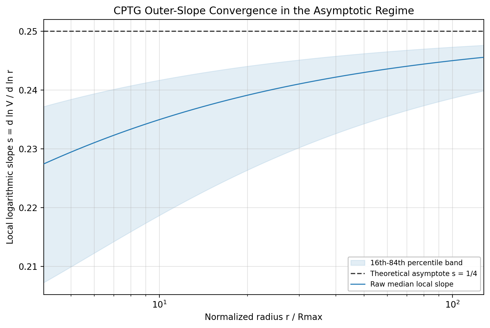
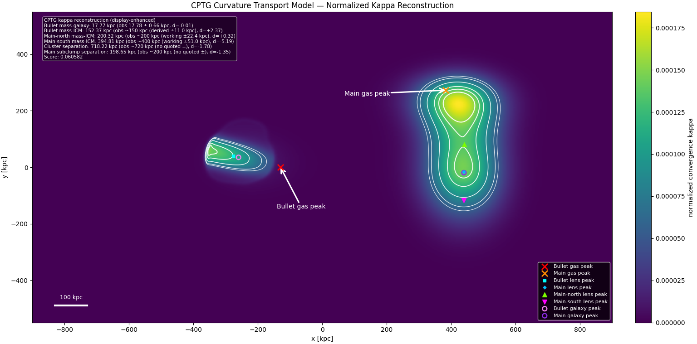
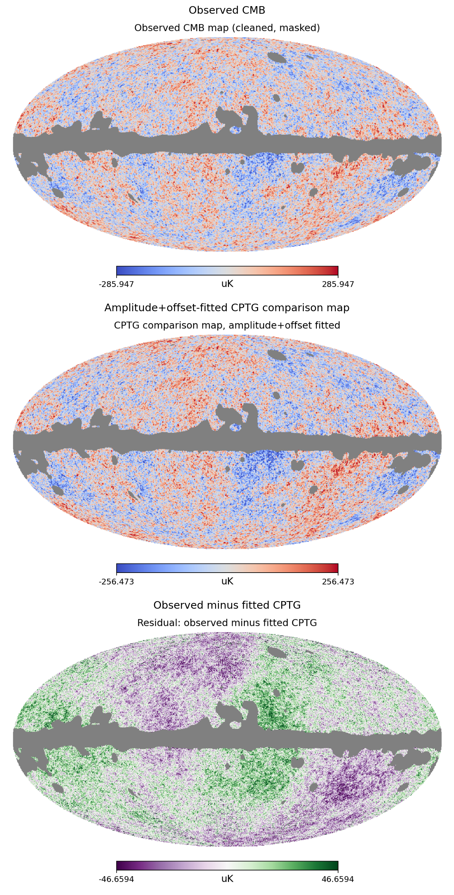

<div align="center">

# Curvature Polarization Transport Gravity

### A geometric framework for gravity, structure, cosmology, and nuclear reactions

Ordinary physical sources · Curvature polarization · Curvature transport

<br>

<a href="#start-here"><strong>Start Here</strong></a>
&nbsp;&nbsp;·&nbsp;&nbsp;
<a href="#current-cptg-status"><strong>Current Status</strong></a>
&nbsp;&nbsp;·&nbsp;&nbsp;
<a href="#repository-and-tools"><strong>Tools</strong></a>
&nbsp;&nbsp;·&nbsp;&nbsp;
<a href="#reproducing-cptg-results"><strong>Reproduce</strong></a>
&nbsp;&nbsp;·&nbsp;&nbsp;
<a href="#citation"><strong>Citation</strong></a>

</div>

---

> **CPTG in one sentence:** Curvature Polarization Transport Gravity treats additional gravitational response across physical scales as organized geometry sourced by ordinary physical matter and fields, with scale-appropriate reductions for the systems being studied.

<table>
<tr>
<td align="center" width="25%"><strong>Gravity</strong><br><sub>Galaxies · Clusters · Compact Objects</sub></td>
<td align="center" width="25%"><strong>Structure</strong><br><sub>Structural Mode N · CSMI</sub></td>
<td align="center" width="25%"><strong>Cosmology</strong><br><sub>π · Acoustic · Luminosity · CMB · BAO</sub></td>
<td align="center" width="25%"><strong>Nuclear</strong><br><sub>H · D · ³He · ⁴He · Network Validation</sub></td>
</tr>
</table>

## Overview

Curvature Polarization Transport Gravity (CPTG) is a geometric-gravity framework in which ordinary physical stress-energy remains the material source while curvature polarization and curvature transport provide additional geometric response.

- **Curvature polarization** describes how sourced geometry reorganizes according to field strength and structural state.
- **Curvature transport** describes how that organized response is retained, redistributed, or directionally carried through an extended or evolving system.

CPTG is a framework of scale-specific reductions rather than one reduced equation applied unchanged to every physical regime. The current published program spans resolved galaxy dynamics, pressure-supported clusters, Structural Mode `N`, dissociative cluster-merger lensing, finite compact objects and black holes, the native geometric π branch and its observational projections, CMB and BAO comparison layers, the Hubble and horizon sectors, and a universal geometric nuclear-reaction construction.

CPTG is not a tunable halo-component model. In the framework, the additional response attributed to CPTG remains geometric; the material source remains ordinary physical stress-energy. The public record separates theory definitions, conditioned reconstructions, held-out or external comparisons, reproducible benchmarks, and active software development.

---

<a id="start-here"></a>
## Start Here

<table>
<tr>
<th width="7%">#</th>
<th width="43%">Paper</th>
<th>Purpose</th>
</tr>
<tr>
<td align="center"><strong>01</strong></td>
<td><a href="https://doi.org/10.5281/zenodo.23172626"><strong>Curvature Polarization Transport Gravity: A Unified Geometric Framework for Structure, Cosmology, and Nuclear Reactions</strong></a></td>
<td>Parent CPTG theory: source-response structure, parent equations, scale architecture, cosmology, compact objects, and nuclear reaction geometry.</td>
</tr>
<tr>
<td align="center"><strong>02</strong></td>
<td><a href="https://doi.org/10.5281/zenodo.23001481"><strong>A New CPTG Gravitational Law — From Galaxies and Galaxy Clusters to Black Holes</strong></a></td>
<td>Current cross-regime gravitational law across rotation-supported galaxies, pressure-supported clusters, and compact-object reductions.</td>
</tr>
<tr>
<td align="center"><strong>03</strong></td>
<td><a href="https://doi.org/10.5281/zenodo.22907311"><strong>CPTG Geometric Pi Branch: Cosmological Comparison Coordinates, Version II</strong></a></td>
<td>Canonical native π branch and its acoustic, affine-luminosity, CMB, distance, lensing, BAO, and clock comparison coordinates.</td>
</tr>
<tr>
<td align="center"><strong>04</strong></td>
<td><a href="https://doi.org/10.5281/zenodo.22439971"><strong>A Universal Geometric Theory of Nuclear Reactions in CPTG</strong></a></td>
<td>Four-sector vertex → bridge → closure → saturation reaction geometry and network-validation hierarchy.</td>
</tr>
</table>

For a less technical introduction, see **[The Science Behind CPTG: A Framework of Scales for Gravity, Structure, Cosmology, and Nuclear Reactions](https://doi.org/10.5281/zenodo.22421593)**.

### Current specialized papers

- **[Structural Mode N in CPTG: Measuring Gravitational Organization from Galaxies to Black Holes](https://doi.org/10.5281/zenodo.23172423)** — cross-regime post-solution structural fingerprint.
- **[Curvature-Bounded Black Holes and Compact Objects in CPTG](https://doi.org/10.5281/zenodo.23172326)** — finite compact interiors, exterior matching, mass-spin handoff, and strong-field admissibility.
- **[CPTG GWTC-5 Compact Object and Population Validation](https://doi.org/10.5281/zenodo.23172497)** — compact-population application of the current CPTG strong-field framework.
- **[CPTG and the Cosmic Standard Ruler: A Direct CMB-to-DESI Test of the Acoustic Projection](https://doi.org/10.5281/zenodo.22935182)** — CMB-to-DESI acoustic-ruler comparison.
- **[CPTG Hubble-Tension Bridge](https://doi.org/10.5281/zenodo.23172759)** — acoustic and affine-luminosity projections of one native geometric history.
- **[CPTG Cosmological Horizon Problem](https://doi.org/10.5281/zenodo.23172701)** — native-origin, geometric-containment, and acoustic-projection treatment of the horizon problem.
- **[Geometric Nuclear Reaction Theory in CPTG: Deuterium-Proton Capture and Primordial Mass-Seven Transport](https://doi.org/10.5281/zenodo.22425309)** — commissioning-stage reaction and primordial mass-seven paper.
- **[PRIMAT-Anchored Reduced-Graph Reachability and the Complete A=1–119 Mass-Sector Register](https://doi.org/10.5281/zenodo.22442178)** — computational companion to the universal nuclear-reaction theory.

---

<a id="current-cptg-status"></a>
## Current CPTG Status

The table below is a reader-facing map of the current program. Detailed methods, evidence, manifests, and integrity records remain with the individual papers and releases.

| Program | Current status | Primary reference |
|---|---|---|
| SPARC galaxy dynamics | v1.13.0 support-conditioned calculation across the primary 153-galaxy sample | [Gravitational law](https://doi.org/10.5281/zenodo.23001481) |
| Pressure-supported clusters | Seven-cluster spherical reconstruction with X-COP primary and ACCEPT sensitivity reconstruction | [Gravitational law](https://doi.org/10.5281/zenodo.23001481) |
| Structural Mode `N` | Cross-regime post-solution structural fingerprint for galaxies, spherical clusters, and compact objects | [Structural Mode](https://doi.org/10.5281/zenodo.23172423) |
| Finite compact objects | Finite spherical interior with required GR exterior matching; rotating quantities retained as post-solution/conditional readouts | [Compact-object paper](https://doi.org/10.5281/zenodo.23172326) |
| GWTC-5 compact population | Current compact-population validation program | [GWTC-5 paper](https://doi.org/10.5281/zenodo.23172497) |
| Bullet Cluster | Public reduced merger-plane curvature-transport/lensing benchmark | Repository benchmark |
| Native π cosmology | Native branch plus fixed acoustic and affine-luminosity comparison projections | [Pi Branch v2](https://doi.org/10.5281/zenodo.22907311) |
| Hubble tension | Acoustic and luminosity endpoints derived as different projections of one native branch | [Hubble paper](https://doi.org/10.5281/zenodo.23172759) |
| Cosmic standard ruler | Direct CMB-to-DESI acoustic-ruler comparison | [Standard Ruler](https://doi.org/10.5281/zenodo.22935182) |
| Cosmological horizon | Native containment and projection treatment | [Horizon paper](https://doi.org/10.5281/zenodo.23172701) |
| CMB comparison maps | Real Planck/WMAP map-space closure and controls | [CMB map closure](https://doi.org/10.5281/zenodo.22413491) |
| Universal nuclear-reaction theory | Four-sector foundation; PRIMAT, PArthENoPE, and PRyMordial authority chain closed/pass | [Universal nuclear theory](https://doi.org/10.5281/zenodo.22439971) |
| Heavy-sector reduced transport | Native PRIMAT authority through A=23; prescribed-bath register through A=119; separately qualified structural continuation through A=338 | [Computational companion](https://doi.org/10.5281/zenodo.22442178) |
| Reaction Workbench | Active engineering and interface development | [`nuclear-reactions/`](nuclear-reactions/) |

---

## Repository and Tools

<table>
<tr>
<th>Resource</th>
<th>Role</th>
<th>Entry point</th>
</tr>
<tr>
<td><strong>Research papers</strong></td>
<td>Published papers, manuscripts, source files, and paper-facing materials.</td>
<td><a href="research_papers/">Open papers</a></td>
</tr>
<tr>
<td><strong>SPARC Browser Workbench v1.13.0</strong></td>
<td>Current local galaxy-analysis environment for the support-conditioned SPARC calculation, batch runs, Structural Mode, and CSMI readout.</td>
<td><a href="https://github.com/CLG2025/CPTG/releases/tag/v1.13.0">Download v1.13.0</a></td>
</tr>
<tr>
<td><strong>Reaction Workbench</strong></td>
<td>PC-first reaction interface for deterministic calculation, comparison, evidence capture, replay, and external-model integration.</td>
<td><a href="nuclear-reactions/">Nuclear materials</a></td>
</tr>
<tr>
<td><strong>CPTG Pi-Bridge</strong></td>
<td>Local research workbench for loading public cosmology data, applying comparison branches, auditing results, and exporting validation packages.</td>
<td><a href="images/CPTG-Pi-Bridge-Local-Workbench.png">View interface</a></td>
</tr>
<tr>
<td><strong>Benchmark results</strong></td>
<td>Public benchmark outputs and comparison results distributed in repository form.</td>
<td><a href="benchmark_results/">Open results</a></td>
</tr>
<tr>
<td><strong>Archive</strong></td>
<td>Historical, protocol, validation, and supporting research materials retained for provenance.</td>
<td><a href="archive/">Open archive</a></td>
</tr>
</table>

The compact `CPTG_academic_package.zip` remains a convenient starting point for the original public SPARC and Bullet Cluster reduced-limit benchmarks. Current cross-regime results should be reproduced from the methods and evidence records attached to the corresponding current papers or releases.

---

## Gravity and Structure

### Galaxies and pressure-supported clusters

The current resolved-gravity program uses the same registered CPTG source-response architecture in two different support geometries: rotation-supported SPARC galaxies and pressure-supported galaxy clusters.

For SPARC galaxies, the v1.13.0 workbench reads the measured radius, observed rotation speed and uncertainty, and tabulated gas, disk, and bulge contributions. The current CPTG reconstruction retains the stellar templates at their reference normalization and does not add a fitted disk or bulge mass-to-light rescaling.

The workbench supports single-object and batch analysis, displays observed/baryonic/CPTG curves, reports the recovered reduced-state coordinates, and evaluates Structural Mode only after the gravitational solution is complete. Catalog morphology is not used to determine the field solution.

For pressure-supported clusters, the same registered field architecture is evaluated through the spherical support reconstruction appropriate to the system. X-COP is the primary cluster reconstruction; ACCEPT provides an independent support-reconstruction sensitivity comparison where used.

[Download CPTG SPARC Browser Workbench v1.13.0](https://github.com/CLG2025/CPTG/releases/tag/v1.13.0)

[SPARC data source](https://astroweb.case.edu/SPARC/): Lelli, McGaugh, and Schombert, *The Astronomical Journal* **152**, 157 (2016).

### Structural Mode N

**[Structural Mode N](https://doi.org/10.5281/zenodo.23172423)** is a dimensionless post-solution measure of gravitational organization derived from the solved CPTG field. It is not a fit parameter, acceleration scale, morphology input, or branch selector.

Its general form is:

```text
N = R / λ
```

where `R` is the outer structural radius of the declared realization and `λ` is the geometry-appropriate organization length derived from the solved field.

Each independently reconstructed field has its own Structural Mode fingerprint. Independent `N` values are reported separately rather than averaged. The parent meaning is common across regimes, while the organization functional follows the geometry of the solved object. CSMI remains a downstream galaxy-classification layer built from the solved continuous mode.

<details>
<summary><strong>What Structural Mode asks</strong></summary>

<br>

> Where are the important structural changes concentrated inside this solved gravitational field?

Lower `N` places the dominant structural organization farther outward; higher `N` places it farther inward. The exact geometry-specific construction is given in the current Structural Mode paper.

</details>

### Outer-slope convergence

The outer-slope convergence test extends the solved galaxy field beyond the last measured SPARC radius and asks whether the reduced CPTG solution approaches its predicted far-outer trend rather than drifting arbitrarily. It is a continuation test of the solved equation, not a fit to artificial outer data.

<p align="center">
  
</p>

<p align="center"><sub>CPTG outer-slope convergence in the extended galaxy-outskirts regime.</sub></p>

### Bullet Cluster benchmark

The `CPTG_Bullet_Cluster_Merger.py` benchmark evaluates a reduced merger-plane curvature-transport/lensing reconstruction using baryonic gas and galaxy components, transported curvature, and observed gas/galaxy/lensing separations.

The primary current observational comparison used by the benchmark is Cha et al. (2025), *A High-Caliber View of the Bullet Cluster through JWST Strong and Weak Lensing Analyses*, *ApJL* **987**, L15.

<p align="center">
  
</p>

<p align="center"><sub>CPTG merger-plane reconstruction showing displaced gas and lensing structure.</sub></p>

### Compact objects and black holes

The current compact-object construction uses a finite physical interior and requires matching to the ordinary Schwarzschild/Kerr exterior where the additional CPTG response becomes negligible. Horizons are allowed; an infinite singularity is not treated as a completed physical state.

The compact reduction separates localized source mass from the geometric contribution to the conserved exterior gravitational charge. The present rotating quantities, including compact Structural Mode, are evaluated downstream of the closed compact state rather than being promoted to a solved general axisymmetric interior.

See **[Curvature-Bounded Black Holes and Compact Objects in CPTG](https://doi.org/10.5281/zenodo.23172326)** and the **[GWTC-5 compact-population paper](https://doi.org/10.5281/zenodo.23172497)**.

---

## Cosmology and Comparison Coordinates

CPTG cosmology begins with one native geometric π branch. Acoustic, affine-luminosity, CMB, BAO, lensing, and distance quantities are comparison projections or downstream coordinates of that native geometry rather than independent cosmologies.

### Native, acoustic, and affine-luminosity coordinates

```text
p_C = π
p_ac = 3 - π/100 = 2.968584073464
G_T = p_ac / π = 0.944929658551
sqrt(G_T) = 0.972074924351

G_L^aff = 10/9
sqrt(G_L^aff) = 1.054092553389

H0^(π)      = 69.4162507897 km s^-1 Mpc^-1
H0_ac^CPTG  = 67.4777967351 km s^-1 Mpc^-1
H0_L^aff    = 73.1711530416 km s^-1 Mpc^-1
```

The acoustic and affine-luminosity coordinates are fixed projections of the same native history. The luminosity normalization `10/9` is derived internally; SH0ES is used afterward as an external observational comparison rather than as the input that defines the branch.

### Hubble tension

The **[Hubble-tension paper](https://doi.org/10.5281/zenodo.23172759)** treats the CMB/acoustic and local luminosity determinations as different observational projections of one native CPTG history:

```text
67.4778  <-  69.4163  ->  73.1712
acoustic      native       luminosity
```

The acoustic projection is compared with Planck, while the affine-luminosity projection is compared independently with SH0ES. The point of the construction is not to average the two observed endpoints into a compromise value, but to identify their distinct comparison coordinates relative to the same native phase.

### Cosmic standard ruler

The **[CPTG Cosmic Standard Ruler](https://doi.org/10.5281/zenodo.22935182)** carries the acoustic projection from the CMB into DESI BAO comparison coordinates. The analysis uses the CPTG acoustic ruler and DESI BAO ratios without promoting the conventional `r_drag` coordinate to a CPTG-native input.

### Cosmological horizon

The **[CPTG horizon paper](https://doi.org/10.5281/zenodo.23172701)** treats the horizon problem through native geometric containment and common-phase synchronization rather than by introducing a separate inflationary scalar-field mechanism into CPTG.

### CMB comparison-map closure

CPTG CMB map work uses a **[real-map comparison test](https://doi.org/10.5281/zenodo.22413491)** against public Planck/WMAP products under the same declared map-space comparison procedure and null controls.

<p align="center">
  
</p>

<p align="center"><sub>Observed Planck SMICA, fitted CPTG comparison map, and residual view from the CMB comparison-map closure analysis.</sub></p>

<details>
<summary><strong>Planck and WMAP inputs used by the strict map-space rerun</strong></summary>

<br>

The survey FITS products are not bundled with the repository. The strict map-space rerun uses the following tested public files. Use these exact products for the strict comparison-map closure rerun; optional masks, alternate component maps, or substitute releases are not part of this input set.

| Test layer | Required local filename | Direct download URL |
|---|---|---|
| Planck SMICA full map | `COM_CMB_IQU-smica_2048_R3.00_full.fits` | <https://irsa.ipac.caltech.edu/data/Planck/release_3/all-sky-maps/maps/component-maps/cmb/COM_CMB_IQU-smica_2048_R3.00_full.fits> |
| Planck SMICA-noSZ full map | `COM_CMB_IQU-smica-nosz_2048_R3.00_full.fits` | <https://irsa.ipac.caltech.edu/data/Planck/release_3/all-sky-maps/maps/component-maps/cmb/COM_CMB_IQU-smica-nosz_2048_R3.00_full.fits> |
| Planck NILC full map | `COM_CMB_IQU-nilc_2048_R3.00_full.fits` | <https://irsa.ipac.caltech.edu/data/Planck/release_3/all-sky-maps/maps/component-maps/cmb/COM_CMB_IQU-nilc_2048_R3.00_full.fits> |
| Planck SEVEM full map | `COM_CMB_IQU-sevem_2048_R3.00_full.fits` | <https://irsa.ipac.caltech.edu/data/Planck/release_3/all-sky-maps/maps/component-maps/cmb/COM_CMB_IQU-sevem_2048_R3.00_full.fits> |
| Planck Commander full map | `COM_CMB_IQU-commander_2048_R3.00_full.fits` | <https://irsa.ipac.caltech.edu/data/Planck/release_3/all-sky-maps/maps/component-maps/cmb/COM_CMB_IQU-commander_2048_R3.00_full.fits> |
| Planck SMICA half-mission 1 | `COM_CMB_IQU-smica_2048_R3.00_hm1.fits` | <https://irsa.ipac.caltech.edu/data/Planck/release_3/all-sky-maps/maps/component-maps/cmb/COM_CMB_IQU-smica_2048_R3.00_hm1.fits> |
| Planck SMICA half-mission 2 | `COM_CMB_IQU-smica_2048_R3.00_hm2.fits` | <https://irsa.ipac.caltech.edu/data/Planck/release_3/all-sky-maps/maps/component-maps/cmb/COM_CMB_IQU-smica_2048_R3.00_hm2.fits> |
| Planck SMICA odd-ring split | `COM_CMB_IQU-smica_2048_R3.00_oe1.fits` | <https://irsa.ipac.caltech.edu/data/Planck/release_3/all-sky-maps/maps/component-maps/cmb/COM_CMB_IQU-smica_2048_R3.00_oe1.fits> |
| Planck SMICA even-ring split | `COM_CMB_IQU-smica_2048_R3.00_oe2.fits` | <https://irsa.ipac.caltech.edu/data/Planck/release_3/all-sky-maps/maps/component-maps/cmb/COM_CMB_IQU-smica_2048_R3.00_oe2.fits> |
| WMAP 9-year ILC map | `wmap_ilc_9yr_v5.fits` | <https://lambda.gsfc.nasa.gov/data/map/dr5/dfp/ilc/wmap_ilc_9yr_v5.fits> |

The Planck rows use the temperature and embedded-mask fields declared by the CMB scripts. The WMAP row is the tested low-\(\ell\) cross-mission support product.

</details>

### Other comparison layers

- **Pantheon+** — full-covariance relative distance-shape comparison with marginalized intercept; not a local `H0` calibration claim.
- **Weak-lensing `S8`** — compressed comparison against representative lensing and CMB anchors; diagnostic rather than a complete survey shear likelihood.
- **DESI ShapeFit / BAO** — compressed-coordinate comparisons and ruler tests; full raw DESI full-shape validation remains a separate, more demanding likelihood-level task.
- **CMB Route B** — development-stage curvature-transport comparison-coordinate work at spectrum/likelihood level, distinct from the real-map closure test.

---

## Universal Geometric Nuclear-Reaction Theory

The nuclear program extends CPTG into a conserved reaction-state geometry organized as:

<table>
<tr>
<td align="center"><strong>Vertex</strong><br><sub>n · p</sub></td>
<td align="center">→</td>
<td align="center"><strong>Bridge</strong><br><sub>Deuterium</sub></td>
<td align="center">→</td>
<td align="center"><strong>Closure</strong><br><sub>³H · ³He</sub></td>
<td align="center">→</td>
<td align="center"><strong>Saturation</strong><br><sub>⁴He</sub></td>
</tr>
</table>

The four sectors form one ordered transport-polarization architecture. The theory separates transport between sectors from the internal charge orientation required by the neutron/proton and tritium/helium-3 pairs.

The **[universal parent paper](https://doi.org/10.5281/zenodo.22439971)** defines the source geometry and conservation structure. The **[computational companion](https://doi.org/10.5281/zenodo.22442178)** carries the registered construction into native PRIMAT calculations and the declared reduced-transport continuation.

### Native-network validation

The same fixed CPTG source geometry has been exercised independently in three native BBN environments:

| Network | Authority | Result | Headline result |
|---|---|---|---|
| **PRIMAT v0.3.2** | Primary | **CLOSED / PASS** | 20,550/20,550 native rows; 428/428 reactions; 84/84 frozen source/Jacobian predictions; worst primary endpoint discrepancy 0.0367629% |
| **PArthENoPE 3.0** | Second | **CLOSED / PASS** | 695/695 native rows; 338/338 matched branch pairs; 84/84 complete ladders; clean-room reconstruction 6/6 |
| **PRyMordial** | Third | **CLOSED / PASS** | 3030/3030-row full-network authority campaign; final integrity, response-ladder, and locked Reaction-20 gates passed |

The validation does not require the three codes to share identical internal currents, source kernels, solver trajectories, or numerical representations. It tests whether the fixed CPTG source construction survives independent native implementations within the declared scope.

### Commissioning and mass-seven transport

The **[commissioning paper](https://doi.org/10.5281/zenodo.22425309)** established the first complete CPTG source-to-reaction-to-rate-to-network chain through `D(p,γ)³He` and the primordial mass-seven transport problem. The published commissioning result retained the deuterium and helium controls while placing the gated lithium result at approximately `+0.90593σ` relative to the declared observational comparison.

The current primary-network implementation separately validates the locked live mass-seven transport inside PRIMAT; all `7/7` paired coordinates pass, with a worst relative survival disagreement of `0.018083%` from the locked target and negligible non-mass-seven control shifts.

### Reduced-graph continuation

The computational companion separates native network authority from the reduced continuation:

- **A ≤ 23:** PRIMAT-native trajectory and endpoint authority.
- **A = 24–119:** complete prescribed-bath reduced-transport register.
- **A = 338:** separately qualified natural structural frontier under the declared reduced topology.

The external `Y_A` values beyond the native network boundary are prescribed-bath reduced-transport populations. They are not presented as self-consistent primordial heavy-element abundances from a coupled PRIMAT heavy-nucleus network.

<details>
<summary><strong>BBN software citations</strong></summary>

<br>

- C. Pitrou, A. Coc, J.-P. Uzan, and E. Vangioni, “Precision big bang nucleosynthesis with improved Helium-4 predictions,” *Physics Reports* **754**, 1–66 (2018), [doi:10.1016/j.physrep.2018.04.005](https://doi.org/10.1016/j.physrep.2018.04.005).
- S. Gariazzo, P. F. de Salas, O. Pisanti, and R. Consiglio, “PArthENoPE revolutions,” *Computer Physics Communications* **271**, 108205 (2022), [doi:10.1016/j.cpc.2021.108205](https://doi.org/10.1016/j.cpc.2021.108205).
- A.-K. Burns, T. M. P. Tait, and M. Valli, “PRyMordial: the first three minutes, within and beyond the standard model,” *The European Physical Journal C* **84**, 86 (2024), [doi:10.1140/epjc/s10052-024-12442-0](https://doi.org/10.1140/epjc/s10052-024-12442-0).

</details>

---

<a id="reproducing-cptg-results"></a>
## Reproducing CPTG Results

The repository contains both historical reduced-limit benchmarks and newer paper-specific reconstruction/evidence packages. Reproduce a result with the method and package attached to that result rather than assuming one script represents every later CPTG reduction.

### Recommended workflow

1. Identify the paper or benchmark being reproduced.
2. Use the corresponding release, reconstruction package, or repository directory named by that work.
3. Preserve the declared input data, coordinate definitions, and fixed theory settings.
4. Run the documented scripts locally with the required Python/runtime environment.
5. Compare the generated outputs with the paper tables, figures, residuals, and included evidence records.

The compact `CPTG_academic_package.zip` remains the starting point for the original reduced-limit SPARC and Bullet Cluster benchmarks. Current v1.13.0 galaxy calculations, cross-regime cluster/compact reconstructions, cosmology comparisons, and nuclear-network validations use their corresponding current paper/release materials.

The individual publications provide the detailed evidence manifests, integrity information, commands, raw outputs, and scope limitations where those records are part of the published validation chain.

---

## Relation to MOND and ΛCDM

CPTG is tested against observations that are also commonly discussed through MOND-type phenomenology or ΛCDM halo-sector modeling, but the constructions are not equivalent.

- **MOND-style comparisons** modify the relation between baryonic acceleration and the inferred gravitational response through a low-acceleration law.
- **ΛCDM analyses** commonly attribute the additional galaxy- and cluster-scale gravitational response to non-baryonic matter components embedded in a cosmological model.
- **CPTG** keeps ordinary physical sources on the material side and attributes the additional response to curvature polarization and curvature transport.

The current v1.13.0 SPARC result is presented as a CPTG support-conditioned reconstruction. Comparison models and older reduced benchmarks remain useful as external reference points, but they do not set the acceptance condition for the current cross-regime CPTG law.

---

## Repository Policies

- [Security policy](SECURITY.md)
- Current papers and source material: [`research_papers/`](research_papers/)
- Historical/protocol material: [`archive/`](archive/)
- Nuclear-reaction software and supporting materials: [`nuclear-reactions/`](nuclear-reactions/)

Detailed evidence records belong with the paper or release that generated them. The README is intended to provide orientation, current status, and reproducibility entry points rather than duplicate every paper-level provenance record.

---

<a id="citation"></a>
## Citation

If referencing the CPTG framework, please cite:

**Carter L. Glass Jr.**, *Curvature Polarization Transport Gravity: A Unified Geometric Framework for Structure, Cosmology, and Nuclear Reactions*, [DOI: 10.5281/zenodo.23172626](https://doi.org/10.5281/zenodo.23172626).

For the repository and supporting code package:

**CPTG**, *Supporting Python Models, Benchmark Implementations, and Research References for Curvature Polarization Transport Gravity*, available at [https://github.com/CLG2025/CPTG](https://github.com/CLG2025/CPTG).

---

<div align="center">
<sub>Curvature Polarization Transport Gravity · Research papers · Reproducible benchmarks · Local analysis tools</sub>
</div>
